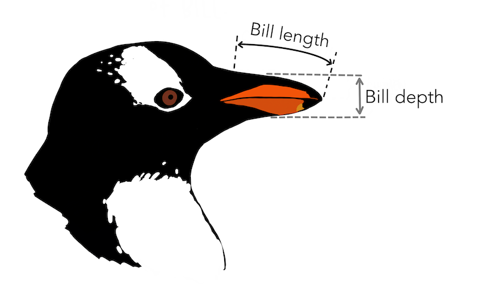
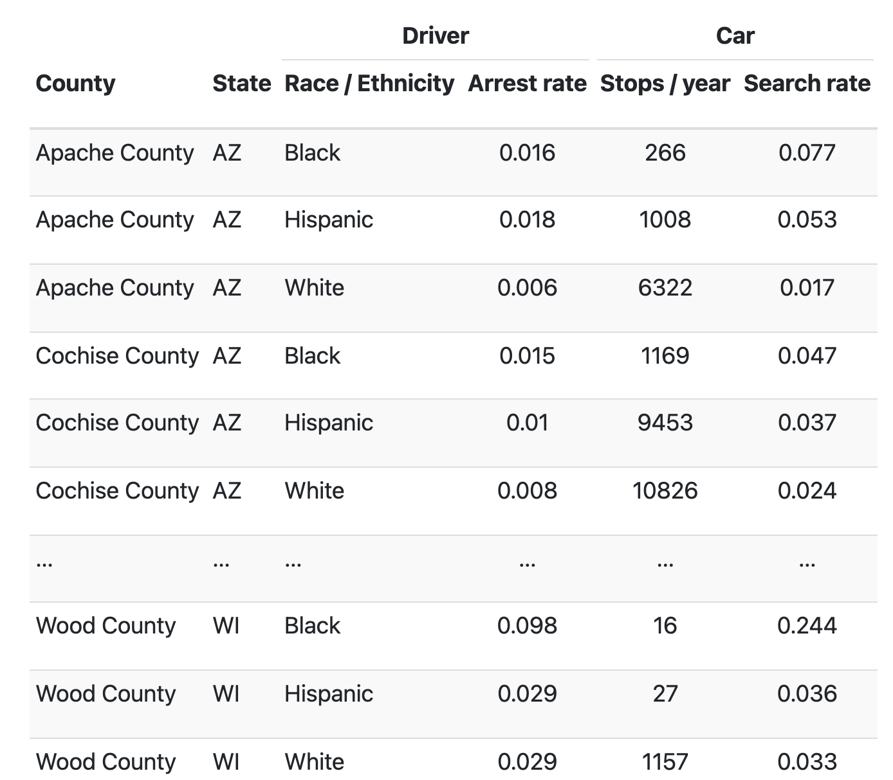
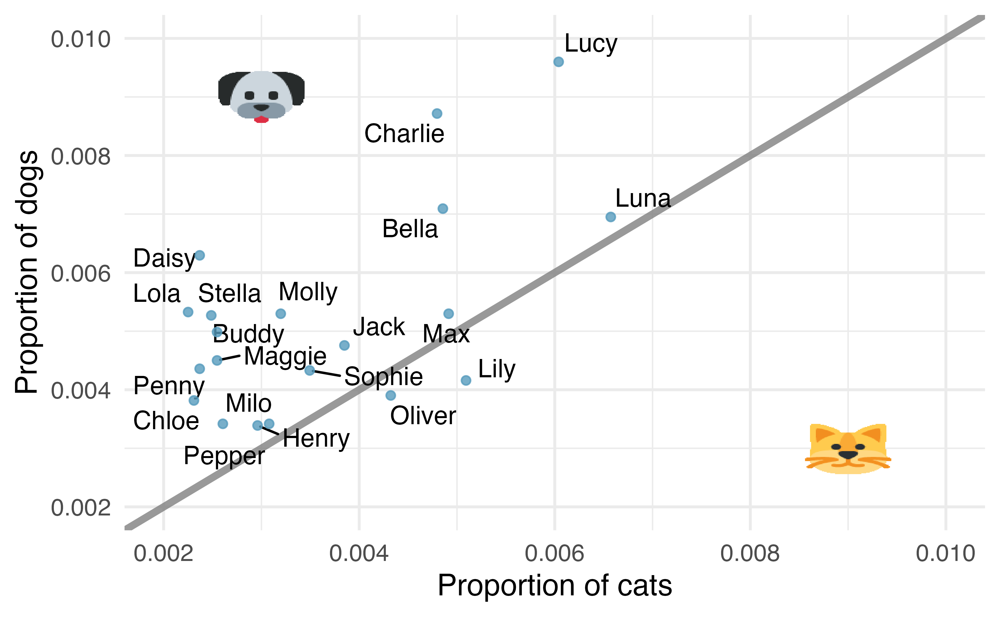

```{r setup, include=FALSE}
library(learnr)
library(tidyverse)
library(openintro)
library(usdata)
gradethis::gradethis_setup()
knitr::opts_chunk$set(echo = FALSE)
```

## Case study: Using stents to prevent strokes
An experiment is designed to study the effectiveness of stents in treating patients at risk of stroke (Chimowitz et al. 2011). Stents are small mesh tubes that are placed inside narrow or weak arteries to assist in patient recovery after cardiac events and reduce the risk of an additional heart attack or death.

Many doctors have hoped that there would be similar benefits for patients at risk of stroke. We start by writing the principal question the researchers hope to answer:

>Does the use of stents reduce the risk of stroke?

The researchers who asked this question conducted an experiment with 451 at-risk patients. Each volunteer patient was randomly assigned to one of two groups:

**Treatment group**. Patients in the treatment group received a stent and medical management. The medical management included medications, management of risk factors, and help in lifestyle modification.

**Control group**. Patients in the control group received the same medical management as the treatment group, but they did not receive stents.

First we must import the `tidyverse` package and the `openintro` package:

```{r setup2, exercise=TRUE}
library(tidyverse)
library(openintro)
```

Using the skills you learned from the tutorial, take a glimpse at the dataset `stent30`:

```{r stent30-glimpse, exercise=TRUE}
glimpse(____)
```

```{r stent30-glimpse-check}
grade_result(
  pass_if(~identical(.result, glimpse(stent30)))
)
```

Now take a glimpse at the `stent365` dataset:

```{r stent365-glimpse, exercise=TRUE}

```

```{r stent365-glimpse-check}
grade_result(
  pass_if(~identical(.result, glimpse(stent365)))
)
```

The code below will count the number of patients in the control and treatment groups who have had a stroke in the `stent30` dataset:
```{r stent30-summary, exercise=TRUE}
stent30 %>%
  count(group, outcome)
```

Use R as a calculator to compute the proportion of those in the control group who had a stroke:
```{r stent30-calculator1, exercise=TRUE}

```

```{r stent30-calculator1-check}
grade_result(
  pass_if(~identical(.result, 13 / (13+214)))
)
```

Use R as a calculator to compute the proportion of those in the treatment group who had a stroke:
```{r stent30-calculator2, exercise=TRUE}

```

```{r stent30-calculator2-check}
grade_result(
  pass_if(~identical(.result, 33 / (191+33)))
)
```

Use code similar that written above to count the number of patients in the control and treatment groups who have had a stroke in the `stent365` dataset:
```{r stent365-summary, exercise=TRUE}

```

```{r stent365-summary-check}
grade_result(
  pass_if(~identical(.result, stent365 %>%
            count(group, outcome))),
  pass_if(~identical(.result, stent365 %>%
            count(outcome, group)))
)
```

For the new dataset, use R as a calculator to compute the proportion of those in the control group who had a stroke:
```{r stent365-calculator1, exercise=TRUE}

```

```{r stent365-calculator1-check}
grade_result(
  pass_if(~identical(.result, 28/(28+199)))
)
```

for the new dataset, use R as a calculator to compute the proportion of those in the treatment group who had a stroke:
```{r stent365-calculator2, exercise=TRUE}

```

```{r stent365-calculator2-check}
grade_result(
  pass_if(~identical(.result, 45 / (179+45)))
)
```

In your group discuss your results. What can we say we about how whether the use of stents prevent strokes? Please put your answers in [this padlet](https://padlet.com/ericfriedlander/br43evrbgtnblwa).


## Data Basics

### Observations, variables, and data matrices

In the console below use `?` to find the help page for the function `head`.

```{r head-help, exercise=TRUE}

```

```{r head-help-check}
grade_result(
  pass_if(~identical(.result, ?head))
)
```

Use the `head` function to display the first 6 rows of the `county` dataset:

```{r display-county, exercise=TRUE}

```

```{r display-county-check}
grade_result(
  pass_if(~identical(.result, head(county)))
)
```

Now let's review some vocabulary:

* **case** or **observational unit**: each row, a single unit of data
* **variable**: each column, a property of each unit of data
* **data frame**: whole table
* **tidy data**: data frame where each row is a unique case (observational unit), each column is a variable, and each cell is a single value

When working with data, it's extremely important that we understand important information about our data, such as what each variable means and what it's unit of measurement is. In the code box below type `?` before `county` to get the **metadata** for this  dataset:

```{r county-meta, exercise=TRUE}

```

```{r county-meta-check}
grade_result(
  pass_if(~identical(.result, ?county))
)
```

Use the code box below to figure out how many *cases* and how many *variables* are in the `county` dataset:

```{r county-sandbox, exercise=TRUE}

```

<div id="county-sandbox-hint">
**Hint:** You may want to use the `glimpse` function.
</div>

```{r cases-question, echo=FALSE}
question("How many *cases* are in the `county` dataset?",
  answer(2000),
  answer(3142, correct = TRUE),
  answer(15),
  answer(43671)
)
```

```{r variables-question, echo=FALSE}
question("How many *variables* are in the `county` dataset?",
  answer(2000),
  answer(3142),
  answer(15, correct = TRUE),
  answer(43671)
)
```


### Types of variables

Recall the different types of variables:

* **numerical**: takes range of numerical values, and it is sensible to add, subtract, or take averages with those values
  + **discrete**: only takes numerical values in jumps
  + **continuous**: takes all values in an interval
* **categorical**: values are categories called **levels**
  + **ordinal**: the **levels** have a natural ordering
  + **nominal**: the **levels** have no ordering
  
Use the following sandbox to answer the following questions about the dataset `county`:
```{r county-sandbox2, exercise=TRUE}

```


```{r variables-question1, echo=FALSE}
question("What kind of variable is `name`?",
  answer("Numerical, Continuous"),
  answer("Numerical, Discrete"),
  answer("Categorical, Ordinal"),
  answer("Categorical, Nominal", correct = TRUE),
  allow_retry = TRUE
)
```

```{r variables-question2, echo=FALSE}
question("What kind of variable is `pop_change`?",
  answer("Numerical, Continuous"),
  answer("Numerical, Discrete", correct = TRUE),
  answer("Categorical, Ordinal"),
  answer("Categorical, Nominal"),
  allow_retry = TRUE
)
```

```{r variables-question3, echo=FALSE}
question("What kind of variable is `smoking_ban`?",
  answer("Numerical, Continuous"),
  answer("Numerical, Discrete"),
  answer("Categorical, Ordinal", correct = TRUE),
  answer("Categorical, Nominal"),
  allow_retry = TRUE
)
```

```{r variables-question4, echo=FALSE}
question("What kind of variable is `multi_unit`?",
  answer("Numerical, Continuous", correct = TRUE),
  answer("Numerical, Discrete"),
  answer("Categorical, Ordinal"),
  answer("Categorical, Nominal"),
  allow_retry = TRUE
)
```

### Relationships between variables
Recall the following definitions:

* **positive association**: when one variable increases, the other variable also increases
* **negative association**: when one variable increases, the other variable decreases
* **independent**: when two variables are not associated.


In the console below plot any two variables which are positively associated in the `county` data set. Then write down these two variables in the [padlet](https://padlet.com/ericfriedlander/br43evrbgtnblwa).
```{r county-positive-association, exercise=TRUE}

```

```{r county-positive-association-hint}
ggplot(____, aes(x=____, y=____)) +
  geom_point()
```

In the console below plot any two variables which are negatively associated in the `county` data set. Then write down these two variables in the [padlet](https://padlet.com/ericfriedlander/br43evrbgtnblwa).
```{r county-negative-association, exercise=TRUE}

```

### Explanatory and Response Variables

When we suspect one variable might causally affect another, we label the first variable the **explanatory variable** and the second the **response variable**. We also use the terms explanatory and response to describe variables where the response might be predicted using the explanatory even if there is no causal relationship.

In console below, write down a research question about the relationship of two numerical variables in the `county` dataset. Write this as a comment. Remember you can use the `#` symbol to write comments in `R`. 

```{r research-question, exercise=TRUE}

```

What is the explanatory and response variable in your research question?

```{r research-exp-resp, exercise=TRUE}

```

Plot of the explanatory vs. the response variable below:

```{r research-scatter, exercise=TRUE}

```

### Observational studies and experiments

* **randomized experiment**: when indiviual are randomly assigned to a groups
* **observational study**: when researchers do not directly interfere with how the data arise

# Homework

## Marvel Cinematic Universe films

The data in the dataframe `mcu_films` contains information on Marvel Cinematic Universe films through the Infinity saga (a movie storyline spanning from Ironman in 2008 to Endgame in 2019). Box office totals are given in millions of US Dollars. Use the console below to answer the questions in this problem.

```{r mcu-consol, exercise=TRUE}

```

```{r mcu-observations, echo=FALSE}
question_numeric(
  "How many observations does this data frame have?",
  answer(7, message = "Sorry, that's the number of variables."),
  answer(23, correct = TRUE),
  allow_retry = TRUE
)
```

```{r mcu-variables, echo=FALSE}
question_numeric(
  "How many variables does this data frame have?",
  answer(23, message = "Sorry, that's the number of observations"),
  answer(7, correct = TRUE),
  allow_retry = TRUE
)
```

## Air pollution and birth outcomes, study components {data-progressive=TRUE}
Researchers collected data to examine the relationship between air pollutants and preterm births in Southern California. During the study air pollution levels were measured by air quality monitoring stations. Specifically, levels of carbon monoxide were recorded in parts per million, nitrogen dioxide and ozone in parts per hundred million, and coarse particulate matter (PM_10) in $\mu g/m^3$. Length of gestation data were collected on 143,196 births between the years 1989 and 1993, and air pollution exposure during gestation was calculated for each birth. The analysis suggested that increased ambient PM_10 and, to a lesser degree, CO concentrations may be associated with the occurrence of preterm births. (Ritz et al. 2000)

Identify the main research question of the study. Enter it below as a comment, this will not be graded. You can click `solution` for the correct solution.

```{r RQ1, exercise=TRUE, exercise.cap="Answer"}
# Answer:
```

```{r RQ1-solution}
# Is there an association between air pollution exposure and preterm births?
```

```{r air-pollution-subjects, echo=FALSE}
question_numeric(
  "How many subjects did this study include are included?",
  answer(143196, correct = TRUE),
  allow_retry = TRUE
)
```

Who were the subjects of this study?  Enter it below as a comment, this will not be graded. You can click `solution` for the correct solution.
```{r ap-subjects2, exercise=TRUE, exercise.cap="Answer"}
# Answer: 
```

```{r ap-subjects2-solution}
# Births in South Carolina between 1989 and 1993.
```

What are the variables in the study? Identify each variable as numerical or categorical. If numerical, state whether the variable is discrete or continuous. If categorical, state whether the variable is ordinal.

```{r ap-variables, exercise=TRUE, exercise.cap="Answer"}
# Answer: 
```

```{r ap-variables-solution}
# Measurements of carbon monoxide, nitrogen dioxide, ozone, and particulate
# matter less than 10 $\mu g/m^3$ (PM_10) collected at air-quality-monitoring 
# stations as well as length of gestation. Continuous numerical variables.
```

<!-- ## Gamification and statistics, study components {data-progressive=TRUE} -->

<!-- Gamification is the application of game-design elements and game principles in non-game contexts. In educational settings, gamification is often implemented as educational activities to solve problems by using characteristics of game elements. Researchers investigating the effects of gamification on learning statistics conducted a study where they split college students in a statistics class into four groups: (1) no reading exercises and no gamification, (2) reading exercises but no gamification, (3) gamification but no reading exercises, and (4) gamification and reading exercises. Students in all groups also attended lectures. Students in the class were from two majors: Electrical and Computer Engineering (n = 279) and Business Administration (n = 86). After their assigned learning experience, each student took a final evaluation comprised of 30 multiple choice question and their score was measured as the number of questions they answered correctly. The researchers considered students’ gender, level of studies (first through fourth year) and academic major. Other variables considered were expertise in the English language and use of personal computers and games, both of which were measured on a scale of 1 (beginner) to 5 (proficient). The study found that gamification had a positive effect on student learning compared to traditional teaching methods involving lectures and reading exercises. They also found that the effect was larger for females and Engineering students. (Legaki et al. 2020) -->

<!-- Identify the main research question of the study. Enter it below as a comment, this will not be graded. You can click `solution` for the correct solution. -->

<!-- ```{r RQ2, exercise=TRUE, exercise.cap="Answer"} -->
<!-- # Answer: -->
<!-- ``` -->

<!-- ```{r RQ2-solution} -->
<!-- # What is the effect of gamification on learning outcomes compared to traditional teaching methods? -->
<!-- ``` -->

<!-- ```{r game-subjects, echo=FALSE} -->
<!-- question_numeric( -->
<!--   "How many subjects did this study include are included?", -->
<!--   answer(365, correct = TRUE), -->
<!--   allow_retry = TRUE -->
<!-- ) -->
<!-- ``` -->

<!-- Who were the subjects of this study?  Enter it below as a comment, this will not be graded. You can click `solution` for the correct solution. -->
<!-- ```{r game-subjects2, exercise=TRUE, exercise.cap="Answer"} -->
<!-- # Answer: -->
<!-- ``` -->

<!-- ```{r game-subjects2-solution} -->
<!-- # Answer:  College students taking a statistics course -->
<!-- ``` -->

<!-- What are the variables in the study? Identify each variable as numerical or categorical. If numerical, state whether the variable is discrete or continuous. If categorical, state whether the variable is ordinal. -->

<!-- ```{r game-variables, exercise=TRUE, exercise.cap="Answer"} -->
<!-- # Answer:  -->
<!-- ``` -->

<!-- ```{r game-variables-solution} -->
<!-- # Gender (categorical)  -->
<!-- # level of studies (categorical, ordinal) -->
<!-- # academic major (categorical) -->
<!-- # expertise in English language (categorical, ordinal) -->
<!-- # use of personal computers and games (categorical, ordinal) -->
<!-- # treatment group (categorical) -->
<!-- # score (numerical, discrete). -->
<!-- ``` -->

## Migraine and acupunture {data-progressive=TRUE}
A migraine is a particularly painful type of headache, which patients sometimes wish to treat with acupuncture. To determine whether acupuncture relieves migraine pain, researchers conducted a randomized controlled study where 89 individuals who identified as female diagnosed with migraine headaches were randomly assigned to one of two groups: treatment or control. Forty-three (43) patients in the treatment group received acupuncture that is specifically designed to treat migraines. Forty-six (46) patients in the control group received placebo acupuncture (needle insertion at non-acupoint locations). Twenty-four (24) hours after patients received acupuncture, they were asked if they were pain free. Results are summarized in the contingency table below. Also provided is a figure from the original paper displaying the appropriate area (M) versus the inappropriate area (S) used in the treatment of migraine attacks. (Allais et al. 2011)

The data for this experiment is stored in the dataframe `migraine`. Use the box below to explore the dataset a little bit:
```{r migraine-sandbox, exercise=TRUE}

```

In the box below count the number of patients who were pain free or not in each group.
```{r migraine-summary, exercise=TRUE}

```

```{r migraine-summary-hint-1}
# Look at what we did in class with the stent data.
```

```{r migraine-summary-hint-2}
# Use the count function
```

```{r migraine-summary-hint-3}
... %>%
  count(..., ...)
```

```{r migraine-summary-check}

grade_result(
  pass_if(~identical(.result, migraine %>%
  count(group, pain_free))),
  pass_if(~identical(.result, migraine %>%
  count(pain_free, group)))
)
```

What percent of patients in the treatment group were pain free 24 hours after receiving acupuncture?

```{r migraine-pf-treat, exercise=TRUE}

```

```{r migraine-pf-treat-check}
grade_result(
  pass_if(~identical(.result, 10/(10+33)))
)
```

What percent were pain free in the control group?

```{r migraine-pf-cont, exercise=TRUE}

```

```{r migraine-pf-cont-check}
grade_result(
  pass_if(~identical(.result, 2/(44+2)))
)
```

```{r painfree-group}
question_radio("In which group did a higher percent of patients become pain free 24 hours after receiving acupuncture?",
 answer("treatment", correct = TRUE),
 answer("control"),
 allow_retry = TRUE
)
```

Your findings so far might suggest that acupuncture is an effective treatment for migraines for all people who suffer from migraines. However, this is not the only possible conclusion. What is one other possible explanation for the observed difference between the percentages of patients that are pain free 24 hours after receiving acupuncture in the two groups?

```{r other-explanation, exercise=TRUE, exercise.cap="Answer"}
# Answer:
```

```{r other-explanation-solution}
# It is possible that the observed difference between the two group percentages is due to chance.
```

```{r acu-explan}
quiz(caption = "",
question("What is the explanatory variable in this study?",
         answer("group", correct = TRUE),
         answer("pain_free"),
         allow_retry = TRUE),
question("What is the response variable in this study?",
         answer("group"),
         answer("pain_free", correct = TRUE),
         allow_retry = TRUE)
)
```

## Efficacy of COVID-19 vaccine on adolescents, study components {data-progressive=TRUE}

Results of a Phase 3 trial announced in March 2021 show that the Pfizer-BioNTech COVID-19 vaccine demonstrated 100% efficacy and robust antibody responses on 12 to 15 years old adolescents with or without prior evidence of SARS-CoV-2 infection. In this trial 2,260 adolescents were randomly assigned to two groups: one group got the vaccine (n = 1,131) and the other got a placebo (n = 1,129). While 18 cases of COVID-19 were observed in the placebo group, none were observed in the vaccine group. (Pfizer 2021)

Is this an observational study or an experiment?

```{r covid-obs, echo=FALSE}
question_radio("Is this an observational study or an experiment?",
               answer("Observational study"),
               answer("Experiement", correct=TRUE),
               allow_retry = TRUE
)
```

What are the cases in this study?
```{r covid-cases, exercise=TRUE, exercise.cap="Answer"}
# Answer:
```

```{r covid-cases-solution}
# Answer: 12 to 15 years old adolescents with or without prior evidence of SARS-CoV-2 infection.
```

```{r covid-numcases, echo=FALSE}
question_numeric("How many cases are included?",
                 answer(2260, correct=TRUE),
                 allow_retry=TRUE
)
```

```{r covid-resp, echo=FALSE}
question("What is the response variable in the study?",
         answer("Outcome (i.e. COVID-19 or no COVID-19", correct=TRUE),
         answer("Group (i.e. vaccine or placebo)", correct=FALSE),
         allow_retry = TRUE
)
```

```{r covid-resptype, echo=FALSE}
question("What type of variable is it?",
         answer("Numeric, continuous", correct=FALSE),
         answer("Numeric, discrete", correct=FALSE),
         answer("Categorical, ordinal", correct=FALSE),
         answer("Categorical, nominal", correct=TRUE),
         allow_retry = TRUE
)
```

```{r covid-exp, echo=FALSE}
question("What is the explanatory variable in the study?",
         answer("Outcome (i.e. COVID-19 or no COVID-19", correct=FALSE),
         answer("Group (i.e. vaccine or placebo)", correct=TRUE),
         allow_retry = TRUE
)
```

```{r covid-exptype, echo=FALSE}
question("What type of variable is it?",
         answer("Numeric, continuous", correct=FALSE),
         answer("Numeric, discrete", correct=FALSE),
         answer("Categorical, ordinal", correct=FALSE),
         answer("Categorical, nominal", correct=TRUE),
         allow_retry = TRUE
)
```


## Palmer penguins
Data were collected on 344 penguins living on three islands (Torgersen, Biscoe, and Dream) in the Palmer Archipelago, Antarctica. In addition to which island each penguin lives on, the data contains information on the species of the penguin (Adelie, Chinstrap, or Gentoo), its bill length, bill depth, and flipper length (measured in millimeters), its body mass (measured in grams), and the sex of the penguin (female or male).16 Bill length and depth are measured as shown in the image. (Gorman, Williams, and Fraser 2014a)



```{r penguin-cases, echo=FALSE}
question_numeric(
  "How many cases were included in the data?",
  answer(344, correct = TRUE)
)
```

For each variable listed below, indicate its type:
```{r penguin-type1, echo=FALSE}
question_radio(
  "species",
  answer("Numeric, continuous", correct=FALSE),
         answer("Numeric, discrete", correct=FALSE),
         answer("Categorical, ordinal", correct=FALSE),
         answer("Categorical, nominal", correct=TRUE),
         allow_retry = TRUE
)
```

```{r penguin-type2, echo=FALSE}
question_radio(
  "island",
  answer("Numeric, continuous", correct=FALSE),
         answer("Numeric, discrete", correct=FALSE),
         answer("Categorical, ordinal", correct=FALSE),
         answer("Categorical, nominal", correct=TRUE),
         allow_retry = TRUE
)
```

```{r penguin-type3, echo=FALSE}
question_radio(
  "bill length in millimeters",
  answer("Numeric, continuous", correct=TRUE),
         answer("Numeric, discrete", correct=FALSE),
         answer("Categorical, ordinal", correct=FALSE),
         answer("Categorical, nominal", correct=FALSE),
         allow_retry = TRUE
)
```

```{r penguin-type4, echo=FALSE}
question_radio(
  "bill depth in millimeters",
  answer("Numeric, continuous", correct=TRUE),
         answer("Numeric, discrete", correct=FALSE),
         answer("Categorical, ordinal", correct=FALSE),
         answer("Categorical, nominal", correct=FALSE),
         allow_retry = TRUE
)
```

```{r penguin-type5, echo=FALSE}
question_radio(
  "flipper length in millimeters",
  answer("Numeric, continuous", correct=TRUE),
         answer("Numeric, discrete", correct=FALSE),
         answer("Categorical, ordinal", correct=FALSE),
         answer("Categorical, nominal", correct=FALSE),
         allow_retry = TRUE
)
```

```{r penguin-type6, echo=FALSE}
question_radio(
  "body mass in grams",
  answer("Numeric, continuous", correct=TRUE),
         answer("Numeric, discrete", correct=FALSE),
         answer("Categorical, ordinal", correct=FALSE),
         answer("Categorical, nominal", correct=FALSE),
         allow_retry = TRUE
)
```

```{r penguin-type7, echo=FALSE}
question_radio(
  "sex",
  answer("Numeric, continuous", correct=FALSE),
         answer("Numeric, discrete", correct=FALSE),
         answer("Categorical, ordinal", correct=FALSE),
         answer("Categorical, nominal", correct=TRUE),
         allow_retry = TRUE
)
```

```{r penguin-type8, echo=FALSE}
question_radio(
  "year",
  answer("Numeric, continuous", correct=FALSE),
         answer("Numeric, discrete", correct=TRUE),
         answer("Categorical, ordinal", correct=FALSE),
         answer("Categorical, nominal", correct=FALSE),
         allow_retry = TRUE
)
```

<!-- ## Smoking habits of UK Residents -->

<!-- A survey was conducted to study the smoking habits of 1,691 UK residents.The data frame `smoking` contains the data collected in this survey. A blank cell or `NA` indicates that data for that variable was not available for a given respondent. -->

<!-- Use the following console to answer the questions below: -->

<!-- ```{r smoking-console, exercise=TRUE} -->

<!-- ``` -->

<!-- What does each row of the data frame represent: -->
<!-- ```{r smoking-rows, exercise=TRUE, exercise.cap="Answer"} -->
<!-- # Answer:  -->
<!-- ``` -->

<!-- ```{r smoking-rows-solution, exercise.cap="Answer"} -->
<!-- # Answer: Each row of the data frame represents a participant in the survey. -->
<!-- ``` -->

<!-- ```{r smoking-num-participants, echo=FALSE} -->
<!-- question_numeric( -->
<!--   "How many participants were included in the survey?", -->
<!--   answer(1691, correct=TRUE) -->
<!-- ) -->
<!-- ``` -->

<!-- For each variable listed below, indicate its type. Make sure to look at the metadata for this dataset: -->
<!-- ```{r smoking-type1, echo=FALSE} -->
<!-- question_radio( -->
<!--   "sex", -->
<!--   answer("Numeric, continuous", correct=FALSE), -->
<!--          answer("Numeric, discrete", correct=FALSE), -->
<!--          answer("Categorical, ordinal", correct=FALSE), -->
<!--          answer("Categorical, nominal", correct=TRUE), -->
<!--          allow_retry = TRUE -->
<!-- ) -->
<!-- ``` -->

<!-- ```{r smoking-type2, echo=FALSE} -->
<!-- question_radio( -->
<!--   "age", -->
<!--   answer("Numeric, continuous", correct=TRUE), -->
<!--          answer("Numeric, discrete", correct=FALSE, message="Even though the data is rounded to whole years age is continuous."), -->
<!--          answer("Categorical, ordinal", correct=FALSE), -->
<!--          answer("Categorical, nominal", correct=FALSE), -->
<!--          allow_retry = TRUE -->
<!-- ) -->
<!-- ``` -->

<!-- ```{r smoking-type3, echo=FALSE} -->
<!-- question_radio( -->
<!--   "martial_status", -->
<!--   answer("Numeric, continuous", correct=FALSE), -->
<!--          answer("Numeric, discrete", correct=FALSE), -->
<!--          answer("Categorical, ordinal", correct=FALSE), -->
<!--          answer("Categorical, nominal", correct=TRUE), -->
<!--          allow_retry = TRUE -->
<!-- ) -->
<!-- ``` -->

<!-- ```{r smoking-type4, echo=FALSE} -->
<!-- question_radio( -->
<!--   "gross_income", -->
<!--   answer("Numeric, continuous", correct=FALSE, message="Make sure you use the `?` command to read the metadata about this dataset."), -->
<!--          answer("Numeric, discrete", correct=FALSE,  message="Make sure you use the `?` command to read the metadata about this dataset."), -->
<!--          answer("Categorical, ordinal", correct=TRUE), -->
<!--          answer("Categorical, nominal", correct=FALSE), -->
<!--          allow_retry = TRUE -->
<!-- ) -->
<!-- ``` -->

<!-- ```{r smoking-type5, echo=FALSE} -->
<!-- question_radio( -->
<!--   "smoke", -->
<!--   answer("Numeric, continuous", correct=FALSE), -->
<!--          answer("Numeric, discrete", correct=FALSE), -->
<!--          answer("Categorical, ordinal", correct=FALSE), -->
<!--          answer("Categorical, nominal", correct=TRUE), -->
<!--          allow_retry = TRUE -->
<!-- ) -->
<!-- ``` -->

<!-- ```{r smoking-type6, echo=FALSE} -->
<!-- question_radio( -->
<!--   "amt_weekends", -->
<!--   answer("Numeric, continuous", correct=FALSE), -->
<!--          answer("Numeric, discrete", correct=TRUE), -->
<!--          answer("Categorical, ordinal", correct=FALSE), -->
<!--          answer("Categorical, nominal", correct=FALSE), -->
<!--          allow_retry = TRUE -->
<!-- ) -->
<!-- ``` -->

<!-- ```{r smoking-type7, echo=FALSE} -->
<!-- question_radio( -->
<!--   "amt_weekdays", -->
<!--   answer("Numeric, continuous", correct=FALSE), -->
<!--          answer("Numeric, discrete", correct=TRUE), -->
<!--          answer("Categorical, ordinal", correct=FALSE), -->
<!--          answer("Categorical, nominal", correct=FALSE), -->
<!--          allow_retry = TRUE -->
<!-- ) -->
<!-- ``` -->


## Stanford Open Policing
The Stanford Open Policing project gathers, analyzes, and releases records from traffic stops by law enforcement agencies across the United States. Their goal is to help researchers, journalists, and policy makers investigate and improve interactions between police and the public. The following is an excerpt from a summary table created based off the data collected as part of this project. (Pierson et al. 2020)
{width=75%}

Suppose we wanted to evaluate whether vehicle search rates are different for drivers of different races. 

```{r stan-police-resp, echo=FALSE}
question("In this analysis, which variable would be the response variable?",
  answer("State"),
  answer("Race/Ethnicity"),
  answer("Arrest rate"),
  answer("Stops/year"),
  answer("Search rate", correct=TRUE),
  allow_retry=TRUE
)
```

```{r stan-police-exp, echo=FALSE}
question_radio("In this analysis, which variable would be the explanatory variable?",
  answer("State"),
  answer("Race/Ethnicity", correct=TRUE),
  answer("Arrest rate"),
  answer("Stops/year"),
  answer("Search rate"),
  allow_retry=TRUE
)
```

## Pet names
The city of Seattle, WA has an open data portal that includes pets registered in the city. For each registered pet, we have information on the pet’s name and species. The following visualization plots the proportion of dogs with a given name versus the proportion of cats with the same name. The 20 most common cat and dog names are displayed. The diagonal line on the plot is the $x=y$ line; if a name appeared on this line, the name’s popularity would be exactly the same for dogs and cats.

{width=75%}

```{r pets-type, echo=FALSE}
question_radio("Are these data collected as part of an experiment or an observational study?",
  answer("Experiment"),
  answer("Observational Study", correct=TRUE),
  allow_retry = TRUE
)
```

```{r commmon-dog, echo=FALSE}
question_text("What is the most common dog name? Make your format your response exactly as it's shown in the graph above.",
  answer("Lucy", correct=TRUE),
  allow_retry = TRUE
)
```

```{r commmon-cat, echo=FALSE}
question_text("What is the most common cat name? Make your format your response exactly as it's shown in the graph above.",
  answer("Luna", correct=TRUE),
  allow_retry = TRUE
)
```

```{r more-common-cat, echo=FALSE}
question_checkbox("Select all names below that are more common in cats?",
  answer("Luna"),
  answer("Daisy"),
  answer("Oliver", correct=TRUE),
  answer("Lily", correct=TRUE),
  answer("Henry"),
  random_answer_order = TRUE,
  allow_retry = TRUE
)
```

```{r pet-relationship, echo=FALSE}
question_radio("Is the relationship positive or negative?",
               answer("Positive, because as the popularity of a name for dogs increases, so does the popularity of that name for cats.", correct=TRUE),
               answer("Positive, because as the popularity of a name for dogs increases, the popularity of that name for cats decreases.", correct=FALSE),
               answer("Negative, because as the popularity of a name for dogs increases, so does the popularity of that name for cats.", correct=FALSE),
               answer("Negative, because as the popularity of a name for dogs increases, the popularity of that name for cats decreases.", correct=FALSE),
               allow_retry = TRUE
)
```


<!-- ## Stressed out in an elevator -->

<!-- In a study evaluating the relationship between stress and muscle cramps, half the subjects are randomly assigned to be exposed to increased stress by being placed into an elevator that falls rapidly and stops abruptly and the other half are left at no or baseline stress. -->

<!-- ```{r elevator-type, echo=FALSE} -->
<!-- question_radio("What type of study is this?", -->
<!--          answer("Observational study"), -->
<!--          answer("Experiment", correct=TRUE), -->
<!--          allow_retry = TRUE -->
<!-- ) -->
<!-- ``` -->

<!-- Can this study be used to conclude a causal relationship between increased stress and muscle cramps? -->
<!-- ```{r elevator-cause, exercise=TRUE, exercise.cap="Answer"} -->
<!-- # Answer: -->
<!-- ``` -->

<!-- ```{r elevator-cause-solution} -->
<!-- # Answer: Yes, since the study is an experiment, we can infer causation. -->
<!-- ``` -->

## Submit

```{css echo=FALSE}
@media print {
  .topicsContainer,
  .topicActions,
  .exerciseActions .skip {
    display: none;
  }
  .topics .tutorialTitle,
  .topics .section.level2,
  .topics .section.level3:not(.hide) {
    display: block;
  }
  .topics {
    width: 100%;
  }
  .tutorial-exercise, .tutorial-question {
    page-break-inside: avoid;
  }
  .section.level3.done h3 {
    padding-left: 0;
    background-image: none;
  }
  .topics .showSkip .exerciseActions::before {
    content: "Topic not yet completed...";
    font-style: italic;
  }
}
```

Make sure you have the tutorial open in a brower (preferably Google Chrome). Please press `print page` button below to print the tutorial. Make sure to print it to a `pdf` file and upload it into Moodle.

```{js print2pdf1, context="server"}
    // the following 2 chunks print the completed sections of the tutorial to PDF
    // uses "css/print2pdf.css"
    $(document).on('shiny:inputchanged', function(event) {
      if (event.name === 'print2pdf') {
        window.print();
      }
    });
    ```
    
```{r print2pdf2}
    # button can be placed anywhere in the tutorial
    actionButton("print2pdf", "Print page", style="opacity: .7; color: #000;")
```