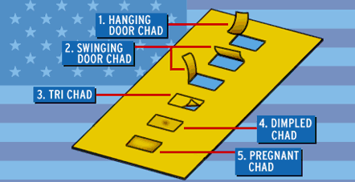

```{r setup, include=FALSE}
library(learnr)
library(openintro)
library(tidyverse)

knitr::opts_chunk$set(echo = FALSE)

population2000 <- read_csv("gss2002.csv") %>% 
  mutate_if(is.character, factor)                           
```

## 2000 Presidential Election

### Designing a poll



From Wikipedia: The 2000 United States presidential election was the 54th quadrennial presidential election, held on Tuesday, November 7, 2000. Republican candidate George W. Bush, the governor of Texas and eldest son of the 41st president, George H. W. Bush, won the election, defeating incumbent Vice President Al Gore. It was the fourth of five American presidential elections, and the first since 1888, in which the winning candidate lost the popular vote, and is considered one of the closest elections in US history, with longstanding controversy surrounding the ultimate results.

For today, I want us to step in our time machines, go back to the year 2000 and pretend that we're pollsters trying to predict the outcome of the election. 

You've been divided into "polling firms" (i.e. groups). The first thing I want you to do with your group is decide on a name for your polling firm. Please let Dr. Friedlande know when you've decided on a name.

What is the population of interest in this scenario? Is it feasible to collect a *census* of the population?

```{r population, exercise=TRUE}
# Answer:
```

Take about 5 minutes to brainstorm how you would try and collect a sample to try and predict who would win the 2000 election. Use vocabulary from class. Important things to consider:

* What information (i.e. variables) would you want to collect about each individual?
* What type of sampling would you use?
* How much labor and expense would it take to collect this sample?
* How will you try to eliminate bias in your sample?

Be prepared to discuss your answer with the class.

### Working with data

{width=50%}

I've assembled a data set, stored as `population2000` which has 100,000 observations and 5 variables. For now, let's pretend that this data set contains the true underlying population (i.e. all voters in the 2000 election) and our goal is the estimate the proportion of voters who will vote for George "Dubya" Bush and what proportion will vote for Al Gore. The variables in the data set are as follows:

* `age`: the voter's age bucketed into equally sized levels `[18,36]`, `(36,53]`, `(53,89]`
<!-- * `race`: the voter's race with levels `white`, `black of african american`, `american indian or alska native`, `asian or pacific islander`, `hispanic`, `other` -->
<!-- * *degree*: the highest degree obtained by the voter with levels: -->
<!--   * `lt high school`: some high school -->
<!--   * `high school`: completed high school -->
<!--   * `junior college`: completed junior college -->
<!--   * `bachelor`: completed a bachelors degree -->
<!--   * `graduate`: completed a graduate degree -->
* `provider`: the voter's phone provider with levels `Sprint`, `Comcast`, `Verizon`, `AT&T`, `Time Warner`
* `pres00`: who they plan to vote for in the 2002 election. The variable has levels `gore`, `bush`, or `nader`

### Population Proportions

Let's first compute the true population proportion of voter's who plan to vote for Bush and Gore. To do that you must:

1. Pipe `population2000` into the `count` function, making sure to count the variable `pres00`. This will create a new column `n` which contains the counts for each candidate.
2. To get the proportions, pipe the output from the previous step into a `mutate` function and specify `prop = n/sum(n)` which will compute the proportion for each level.

```{r bush-popprop, exercise=TRUE}

```

```{r bush-popprop-hint-1}
____ %>%
  ____(____) %>%
  ____(____)
```

```{r bush-popprop-hint-2}
____ %>%
  count(____) %>%
  mutate(____)
```

```{r bush-popprop-hint-3}
population2000 %>%
  count(pres00) %>%
  mutate(prop = n / sum(n))
```


### Simple Random Sample

Now suppose that you only have enough funding to collect a sample of 300 voters. Take a simple random sample of 300 voters from `population2000`, and call it `pop2000_srs` (note that this will not generate any output). The function `slice_sample` will automatically select a simple random sample for you. All you need to do is:

1. Pipe `population2000` into `slice_sample`.
2. Specify your sample size `n = 300`.
3. Make sure to store the result in a dataframe called `pop2000_srs`.
4. Note that this will not generate any output because you are assigning the result to `pop2000_srs`.

```{r srs-setup}
set.seed(1989)
```

```{r srs, exercise=TRUE}

```

```{r srs-hint-1}
# You may find the function `slice_sample` useful.
```

```{r srs-hint-2}
pop2000_srs <- ____ %>%
  ____(n = ____)
```

```{r srs-hint-3}
pop2000_srs <- ____ %>%
  slice_sample(n = ____)
```

```{r srs-hint-4}
pop2000_srs <- population2000 %>%
  slice_sample(n = 300)
```


Now, using similar code as above, compute the sample proportion of voter's who plan to vote for Bush and Gore. To do that you must:

1. Pipe `pop2000_srs` into the `count` function, making sure to count the variable `pres00`. This will create a new column `n` which contains the counts for each candidate.
2. To get the proportions, pipe the output from the previous step into a `mutate` function and specify `prop = n/sum(n)` which will compute the proportion for each level.

```{r srs-gen}
set.seed(1989)
pop2000_srs <- population2000 %>%
  slice_sample(n = 300)
```

```{r srs-prop, exercise=TRUE, exercise.setup="srs-gen"}

```

```{r srs-prop-hint-1}
____ %>%
  ____(____) %>%
  ____(____)
```

```{r srs-prop-hint-2}
____ %>%
  count(____) %>%
  mutate(____)
```

```{r srs-prop-hint-3}
pop2000_srs %>%
  count(pres00) %>%
  mutate(prop = n / sum(n))
```


### Using phone providers

The way that your firm actually conducts your poll is by paying different phone providers for a list of numbers for you to dial. Suppose that you don't have enough money to pay all 5 telecom companies so you decide to randomly select 2 providers and conduct a simple random sample of size 150 in each. Assume that the properties of the population of voters that use each provider are very similar.

```{r ms-q}
question_radio(
  "What type of sample is this?",
  answer("Simple Random Sample"),
  answer("Stratified Sample"),
  answer("Cluster Sample", message="Very close! This would be a cluster sample if we were to survey all of the voters for the selected providers."),
  answer("Multistage Sample", correct=TRUE, message="Correct! This is a multistage sample since we first select a sample of providers and then a simple random sample of voters belonging to each provider."),
               allow_retry = TRUE
)
```

### Multistage Sampling

We have made the assumption that those using each provider are very similar. Brainstorm some reasons why this may not be true and be ready to share those reasons with the class.

The code below will randomly select a sample of 2 providers. The `distinct` function gets the levels of the `provider` variable and the `slice_sample`to take a random sample of output from `distinct`. Feel free to use `?` to look up the help files on these function. Remember that you can select a 

```{r select-providers-setup}
set.seed(2000)
```

```{r select-providers, exercise=TRUE}

```

```{r select-providers-hint-1}
_____ %>%
  _____ %>%
  _____)
```

```{r select-providers-hint-2}
population2000 %>%
  distinct(_____) %>%
  slice_sample(n=_____)
```

```{r select-providers-hint-3}
population2000 %>%
  distinct(provider) %>%
  slice_sample(n=2)
```


As we can see we're surveying customers of Time Warner and Sprint. In the console, use the `filter` function to generate a dataframe called `pop2000_tw_sprint` which contains only customers of Time Warner and Sprint. Recall that `==` tests whether two things are equal and `|` stands for a [logical "or"](https://en.wikipedia.org/wiki/Logical_disjunction). Try and do this without the hints. Does this generate output? Why or why not?

```{r providers-filter, exercise=TRUE}

```

```{r providers-filter-hint-1}
pop2000_tw_sprint <- population2000 %>%
  filter(provider == ____ | provider == _____)
```

```{r providers-filter-hint-2}
pop2000_tw_sprint <- population2000 %>%
  filter(provider == "Time Warner" | provider == "Sprint")
```

Using `pop2000_tw_sprint`, collect a simple random sample of size 150 and create a dataframe containing counts of Bush and Gore voters within each cluster. To do this:

1. Pipe `pop2000_tw_sprint` into the function `group_by`. Make sure to group by provider.
2. Pipe the result into the `slice_sample` function. Make sure to specify the sample size.
3. Pipe the result into `ungroup`.We do this because so that when we eventually compute the proportion of voters who plan on voting for each candidate, it won't aggregate by `provider`.
4. Store the result in a dataframe called `pop2000_provider_srs`.

```{r providers-srs-setup}
set.seed(5001)

pop2000_tw_sprint <- population2000 %>%
  filter(provider == "Time Warner" | provider == "Sprint")
```

```{r providers-srs, exercise=TRUE}
# Add code below:


# Add code above. The line below will print out your result
glimpse(pop2000_provider_srs)
```

```{r providers-srs-hint-1}
pop2000_provider_srs <- _____ %>%
  _____(_____) %>%
  _____(_____) %>%
  _____
```

```{r providers-srs-hint-2}
pop2000_provider_srs <- pop2000_tw_sprint %>%
  group_by(_____) %>%
  slice_sample(_____) %>%
  ungroup()
```

```{r providers-srs-hint-3}
pop2000_provider_srs <- pop2000_tw_sprint %>%
  group_by(provider) %>%
  slice_sample(n=150) %>%
  ungroup()
```


Compute the proportion of voters in `pop2000_provider_srs` who plan on voting for Gore and Bush in the console below:

```{r providers-prop-setup}
set.seed(5001)

pop2000_tw_sprint <- population2000 %>%
  filter(provider == "Time Warner" | provider == "Sprint")

pop2000_provider_srs <- pop2000_tw_sprint %>%
  group_by(provider) %>%
  slice_sample(n=150) %>%
  ungroup()
```

```{r providers-prop, exercise=TRUE}

```

```{r providers-prop-hint-1}
_____ %>%
  count(_____) %>%
  mutate(_____)
```

```{r providers-prop-hint-2}
pop2000_provider_srs %>%
  count(pres00) %>%
  mutate(prop = n / sum(n))
```


Would you expect this sampling scheme to be more or less accurate than a simple random sample? Why? Be prepared to discuss your answer with the class.


### Using age

Your polling firm has done some research and has found that people's voting behaviors greatly vary based on their age. As a result, when you create your sample, you want to make sure that the sample you collect accurately represents the distribution of ages in the population. The variable `age` contains three age buckets with a (roughly) equal number of voters. To assemble your sample, you plan to select 100 voters from each bucket.

```{r strat-q}
question_radio(
  "What type of sample is this?",
  answer("Simple Random Sample"),
  answer("Stratified Sample", correct=TRUE),
  answer("Cluster Sample"),
  answer("Multistage Sample"),
               allow_retry = TRUE
)
```

### Stratified Sampling

In the console below assemble a sample of 300 voters by selecting 100 from each age bucket. You can reuse some of the code above when we generated a sample of 150 from two different telecom providers. Call the new dataframe `pop2000_strat` (note that this will not generate output):

```{r strat-gen-setup}
set.seed(2020)
```

```{r strat-gen, exercise=TRUE}
pop2000_strat <-
```

```{r strat-gen-hint-1}
# 1. Pipe population2000 into a group_by function (make sure to group by age)
# 2. Pipe this result into a slice_sample function (make sure to select the correct sample size)
# 3. Pipe this result into an ungroup function
```

```{r strat-gen-hint-2}
pop2000_strat <- _____ %>%
  _____(_____) %>%
  _____(_____) %>%
  _____
```

```{r strat-gen-hint-3}
pop2000_strat <- population2000 %>%
  group_by(_____) %>%
  slice_sample(_____) %>%
  ungroup()
```

```{r strat-gen-hint-4}
pop2000_strat <- population2000 %>%
  group_by(age) %>%
  slice_sample(n = 100) %>%
  ungroup()
```


Finally compute the proportion of voters who plan on voting for each candidate in this new stratified sample:

```{r strat-prop-setup}
set.seed(2020)

pop2000_strat <- population2000 %>%
  group_by(age) %>%
  slice_sample(n = 100) %>%
  ungroup()
```

```{r strat-prop, exercise=TRUE}

```

```{r strat-prop-hint-1}
_____ %>%
  _____(_____) %>%
  _____(_____)
```

```{r strat-prop-hint-2}
pop2000_strat %>%
  count(_____) %>%
  mutate(_____)
```

```{r strat-prop-hint-3}
pop2000_strat %>%
  count(pres00) %>%
  mutate(prop = n / sum(n))
```


Would you expect this sampling method to be more or less accurate than simple random sampling? Why? Be prepared to discuss your answer with the class.

### Using race

Your polling firm has done further research and has found that people's voting behaviors vary even more based on their race. The problem is that there aren't an equal number of voters of each race. Brainstorm how you might generate a sample that is representative of the population and ways you might go about creating an unbiased estimate of the proportion of voters who vote for each candidate. Be prepared to discuss your answer with the class. 


