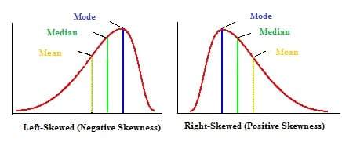

```{r setup, include=FALSE}
library(learnr)
library(openintro)
library(tidyverse)

set.seed(150)
mult <- .05
income <- rgamma(n = 10000, shape=50*mult, rate = .0007*mult)

income2 <- income + rlnorm(n=10000, mean= 0 , sd = .3)
retirement_age <- (-income2/max(income2) + 1)*79

sims <- tibble(income = income, retirement_age = retirement_age)


covid <- read_csv("simpsons_paradox_covid.csv")

knitr::opts_chunk$set(echo = FALSE)
```


## Numerical Summary Statistics

Suppose we have the following data: 0, 1, 2, 3, 4, 5, 6, 7, 8, 9, 10

In the console below, use R as a calculator to compute the mean, median, and interquartile range of this data. Don't use any built-in R functions other than addition and division.

```{r calculator-1, exercise=TRUE}

```


We'll now use R to compute the variance and standard deviation. First let's explore some R functionality that will be helpful. In the console below we define a vector named `x` with elements 0, 1, 2, and 3 and do some arithmetic with it. Notice how if we add, subtract, multiply, divide, or exponentiate by a single number it applies that operation to the whole vector.

```{r vector, exercise=TRUE}
# Define vector x
x <- c(0, 1, 2, 3)

# Addition/Subtraction
x - 3

# Multiplication/Divions
x/2

# Exponents
x^3


```

With this in mind, compute the variance and standard deviation of our set of numbers given above. Note that `sqrt` is the function for square root:

```{r var-sd, exercise=TRUE}
# Define vector
x <- 
print(x)

# Subtract mean to compute deviations
deviations <- 
print(deviations)

# Square deviations
dev_squared <-
print(dev_squared)
  
# Use the sum() function to sum up all the entries in dev_squared
sum_dev_squared <-
print(sum_dev_squared)
  
# Divide by n-1 to get variance
variance <- 
  
# Take square root to get standard deviation
standard_deviation <- 
  
# Print out variance and standard deviation
variance
standard_deviation
```

While this is "fun", R does provide functions that will do all of this for us:

```{r R-func, exercise=TRUE}
x <- c(0, 1, 2, 3, 4, 5, 6, 7, 8, 9, 10)

mean(x)
median(x)
IQR(x)
var(x)
sd(x)
```

Suppose we change the value 10 to 100 in our little data set.

```{r robust-qs}
question_checkbox("Select all statistics will increase as a result.",
               answer("mean", correct=TRUE),
               answer("median"),
               answer("IQR"),
               answer("variance", correct=TRUE),
               answer("standard deviation", correct=TRUE),
               allow_retry = TRUE)
```

This is because median and IQR are **robust statistics** meaning they aren't sensitive to outliers like the mean, variance, and standard deviation.

Suppose, instead of changing 10 to 100, we changed 0 to 100.

```{r robust-qs2}
question_checkbox("Select all statistics will increase as a result.",
               answer("mean", correct=TRUE),
               answer("median", correct=TRUE),
               answer("IQR"),
               answer("variance", correct=TRUE),
               answer("standard deviation", correct=TRUE),
               allow_retry = TRUE)
```

Suppose, instead of changing changed 0 to 100, we add 100 to every data point.

```{r robust-qs3}
question_checkbox("Select all statistics will increase as a result.",
               answer("mean", correct=TRUE),
               answer("median", correct=TRUE),
               answer("IQR"),
               answer("variance"),
               answer("standard deviation"),
               allow_retry = TRUE)
```

In this example, we are increasing the center of our data but the overall spread doesn't change. This implies that the only statistics which will increase are the mean and median.

Suppose, instead of adding 100 to every data point, we multiply every data point by 10.

```{r robust-qs4}
question_checkbox("Select all statistics will increase as a result.",
               answer("mean", correct=TRUE),
               answer("median", correct=TRUE),
               answer("IQR", correct=TRUE),
               answer("variance", correct=TRUE),
               answer("standard deviation", correct=TRUE),
               allow_retry = TRUE)
```

Since we're increasing the center AND the spread all of the statistics will increase. 

Now consider the set of data: -5, -4, -3, -2, -1, 0, 1, 2, 3, 4, 5. Suppose we were to multiply every data point in this data set by 10.

```{r robust-qs5}
question_checkbox("Select all statistics will increase as a result.",
               answer("mean"),
               answer("median"),
               answer("IQR", correct=TRUE),
               answer("variance", correct=TRUE),
               answer("standard deviation", correct=TRUE),
               allow_retry = TRUE)
```

Since the data is symmetric around zero, when we multiply, every increase from a positive data point is matched by a corresponding decrease from a negative data point which causes the center to remain the same. As a result the only thing that increases is the spread of the data.

The console below has access to a data frame called `sims` which contains simulated data with variables `income` and `retirement_age`. Create a histogram for each variable. Experiment with different binwidths to get a histogram which you feel accurately reflects to data without adding too much noise. **WARNING:** for `income` you will want to choose a binwidth of at least 1000 or R will take a very long time creating your histogram.


```{r skew, exercise=TRUE}
# income histogram

# retirement_age histogram

```

```{r skew-hint-1}
# income histogram
ggplot(sims, aes(x=____)) +
  _____(_____ = _____)

# retirement_age histogram

```

```{r skew-hint-2}
# income histogram
ggplot(sims, aes(x=____)) +
  geom_histogram(binwidth = _____)

# retirement_age histogram

```

```{r skew-hint-3}
# income histogram
ggplot(sims, aes(x=income)) +
  geom_histogram(binwidth = 15000)

# retirement_age histogram

```

```{r skew-qs}
quiz(
  question_checkbox(
    "Check all that apply to the distribution of the income variable?",
            answer("Left-Skewed"),
            answer("Right-Skewed", correct=TRUE),
            answer("Unimodal", correct=TRUE),
            answer("Bimodel"),
            answer("Multimodel"),
            allow_retry = TRUE
    ),

question_checkbox(
    "Check all that apply to the distribution of the reitrement_age variable?",
            answer("Left-Skewed", correct=TRUE),
            answer("Right-Skewed"),
            answer("Unimodal", correct=TRUE),
            answer("Bimodel"),
            answer("Multimodel"),
            allow_retry = TRUE
    )
)
```


```{r outliers-q}
question("Which of the following plots would be best for indicating whether `income` or `retirement_age` have outliers?",
         answer("histogram"),
         answer("density plot"),
         answer("box plot", correct=TRUE),
         answer("dot plot"),
         allow_retry=TRUE
         )
```


In the console below create box plots for both variables, `income` and `retirement_age`:

```{r boxplots, exercise=TRUE}
# box plot of income


# box plot of retirement_age


```

```{r boxplots-hint-1}
# box plot of income
ggplot(____, ___(_____)) +
  _____()

# box plot of retirement_age

```

```{r boxplots-hint-2}
# box plot of income
ggplot(____, aes(x = _____)) +
  geom_boxplot()

# box plot of retirement_age


```

```{r boxplots-hint-3}
# box plot of income
ggplot(sims, aes(x = income)) +
  geom_boxplot()

# box plot of retirement_age (you can repurpose the code for the previous plot)

```

Take a minute and discuss with your group some of the properties of the data you notice in your box plots.

There are two takeaways that I'd like to impress upon you with these plots:

1. For left-skewed data, we have a lot of data points which are much lower than the median. For right-skewed data, we have a lot of data points which are much higher than the median.
2. It is unlikely that we have SO MANY outliers. In fact, **there is no single agreed upon way to numerically define an outlier**. There are some heuristics. For example, the `geom_boxplot` function defines an outlier as anything which is more than \(1.5\times IQR\) above $Q_3$ or below $Q_1$. However, as we can see above, this is NOT a good heuristic when we have heavily skewed data. In practice, you will want to use a variety of techniques (e.g. histograms, box plots, scatter plots) and **knowledge about how your data was created** in order to determine if you have outliers in your data.

Keeping the first point above in mind and using our knowledge of robust statistics:

```{r mean-median-q}
quiz(
  question("Which do you expect to be larger?",
           answer("Mean Income", correct=TRUE),
           answer("Median Income"),
           allow_retry=TRUE),
  question("Which do you expect to be larger?",
           answer("Mean Retirement Age"),
           answer("Median Retirement Age", correct=TRUE),
           allow_retry=TRUE)
)
```

In the console below, use the `summarize` function to compute the mean and median of both variables to verify our answers above:

```{r mean-median, exercise=TRUE}

```

```{r mean-median-hint-1}
sims %>%
  summarize(
    mean_income = _____,
    median_income = ______,
    mean_retirement = ______,
    median_retirement = ______
  )
```

```{r mean-median-hint-2}
sims %>%
  summarize(
    mean_income = mean(_____),
    median_income = median(_____),
    mean_retirement = ______,
    median_retirement = ______
  )
```

```{r mean-median-hint-3}
sims %>%
  summarize(
    mean_income = mean(_____),
    median_income = median(_____),
    mean_retirement = ______,
    median_retirement = ______
  )
```


```{r mean-median-hint-4}
sims %>%
  summarize(
    mean_income = mean(income),
    median_income = median(income),
    mean_retirement = ______,
    median_retirement = ______
  )
```

It's true! In fact, this will be true in general and you can include the mode if you want:

{width=100%}

## COVID Vaccine and Simpson's Paradox

In this activity we're going to use contingency tables and bar charts to explore a data set on Delta Variant COVID-19 cases in the UK from the second quarter of 2021. Let start by taking a look at the dataset. It's called `covid`. How many rows and columns does it have? What are the variables?

```{r covid-explore, exercise=TRUE}

```

When beginning to work with a dataset it makes sense to explore some of the properties of the data before starting to make inferences. In the console below generate a contingency table with `age_group` in the columns and `outcome` in the rows. To do this:

1. Pipe `covid` into the `count` function making sure to add `age_group` and `outcome` as arguments in `count`.
2. Pipe the result into the `pivot_wider` function. Make sure to use the `id_cols` and `names_from` arguments to specifiy which variables you need and which variable will be the columns. In addition, make sure you specify `values_from = n` so R knows where to get the counts from.

```{r age-cont, exercise=TRUE}

```

```{r age-cont-hint-1}
covid %>%
  _____(____, ____) %>%
  ____(id_cols = ____, names_from = _____, values_from = _____)
```

```{r age-cont-hint-2}
covid %>%
  count(_____, _____) %>%
  pivot_wider(id_cols =  _____, names_from = _____, values_from = _____)
```

```{r age-cont-hint-3}
covid %>%
  count(outcome, age_group) %>%
  pivot_wider(id_cols = outcome, names_from = age_group, values_from = n)
```


Unless you need the actual numbers, a better way to summarize your data is visually, using a bar plot. Take a minute and brain storm what type of bar plot would be best to visualize this data if we're only interested in the relative sizes of each group.

```{r best-bar}
question_radio("Which plot would be best?",
               answer("Stacked Bar", message="This one would be ok but it can sometimes be hard to see what raw counts are with a stacked bar plot."),
               answer("Dodged Bar Chart", correct=TRUE),
               answer("Standardized Bar Chart", message="This isn't good since we can't see the counts in this plot."),
               allow_retry = TRUE)
```

In the console below create a dodged bar plot with `age_group` on the x-axis and the colors corresponding to `outcome`.

1. Create a plot using the `ggplot` function. Make sure to specify the dataset, the `x` variable, and `fill` variable (`outcome`)
2. Add a `geom_bar` with `position = "dodge"`.

```{r dodge-plot, exercise=TRUE}

```

```{r dodge-plot-hint-1}
ggplot(____, ____(x =_____, fill = _____)) +
  geom_bar(____ = "____")
```

```{r dodge-plot-hint-2}
ggplot(covid, aes(x =_____, fill = _____)) +
  geom_bar(fill = "____")
```

```{r dodge-plot-hint-3}
ggplot(covid, aes(x=age_group, fill=outcome)) +
  geom_bar(position = "dodge")
```

It's difficult to see the deaths on this plot. Instead, let's use something called faceting to visualize the survivors and dead in different plots. In the console below add a layer called `facet_wrap` to create bar charts for each `outcome` with `age_group` on the x-axis. If you use `~outcome`, it will make a separate plot for each category in `outcome` similar to the `group_by` function. To do this:

1. Create a plot using ``ggplot``, specifying the x-variable in the `aes` function. There's no need for a `fill` argument.
2. Add a `geom_bar` layer.
3. Add a `facet_wrap` layer making sure to specify `~outcome`.

```{r facet-age, exercise=TRUE}
# Create plot
____ +
  # geom_bar layer
  ____ +
  # facet wrap layer, not that the scales argument will allow the bar charts to have different y limits
  facet_wrap(____, scales="free_y")
```

```{r facet-age-hint-1}
# Create plot
ggplot(____, aes(x=____)) +
  # geom_bar layer
  geom_bar() +
  # facet wrap layer, not that the scales argument will allow the bar charts to have different y limits
  facet_wrap(____, scales="free_y")
```

```{r facet-age-hint-2}
# Create plot
ggplot(____, aes(x=____)) +
  # geom_bar layer
  geom_bar() +
  # facet wrap layer, not that the scales argument will allow the bar charts to have different y limits
  facet_wrap(~outcome, scales="free_y")
```

```{r facet-age-hint-3}
# Create plot
ggplot(covid, aes(x=age_group)) +
  # geom_bar layer
  geom_bar() +
  # facet wrap layer, not that the scales argument will allow the bar charts to have different y limits
  facet_wrap(~outcome, scales="free_y")
```

What do you notice in these plots? Be prepared to discuss your observations with the class.

### Vaccine efficacy

We'd like to explore how effective COVID-19 vaccines are at preventing death. To do this, we'll use a contingency table. Suppose we split out the rows by `vaccine_status` and the columns by `outcome`.

```{r rowsum-q}
question_radio("What type of table will be best to assess the efficacy of the vaccine?",
               answer("Counts"),
               answer("Total proportions"),
               answer("Row Proportions, rows sum to 1", correct=TRUE),
               answer("Column Proportions, columns sum to 1"),
               allow_retry = TRUE
)
```

In the console below, create the contingency table discussed above. Make sure to `group_by` the correct variable, then use `mutate` to compute the proportions:

```{r cont-vax-eff, exercise=TRUE}

```

```{r cont-vax-eff-hint-1}
covid %>%
  group_by(____) %>%
  count(____) %>%
  mutate(prop = ____) %>%
  pivot_wider(id_cols=_____, names_from = _____, values_from = _____)
```

```{r cont-vax-eff-hint-2}
covid %>%
  group_by(vaccine_status) %>%
  count(outcome) %>%
  mutate(prop = n/sum(n)) %>%
  pivot_wider(id_cols=vaccine_status, names_from = outcome, values_from = prop)
```

Based on these results what are your initial impressions on the efficacy of the vaccine in preventing death due to the delta variant? Be prepared to discuss your results with the class.

### Simpson's Paradox

In the console below, create a standardized bar chart showing the proportion of vaccinated and unvaccinated individuals who are from each age group. You can use similar to code to above, just make sure you specify `position="fill"` in the `geom_bar` layer. I encourage you to also label the y-axis as "Proportion":

```{r stand-bar1, exercise=TRUE}

```

```{r stand-bar1-hint-1}
ggplot(____, aes(x=____, fill=____)) +
  geom_bar(____="____") +
  labs(y="Proportion")
```

```{r stand-bar1-hint-2}
ggplot(covid, aes(x=vaccine_status, fill=age_group)) +
  geom_bar(position="fill")+
  labs(y="Proportion")
```

What do you notice? How are are the vaccines distributed? Be prepared to discuss your answer with the class.

Hmmm... Let's take a look at the mortality rate broken out by `vaccine_status` and `age_group`. Create two contingency tables below, one for each age bucket. You can use the `filter(age_group == "50+")`  and `filter(age_group == "under 50")` commands to help you:

```{r cavid-by-age, exercise=TRUE}
# 50+ table
____ %>%
  filter(____) %>%
  group_by(____) %>%
  count(____) %>%
  mutate(____) %>%
  pivot_wider(id_cols= _____, names_from = _____, values_from = _____)

# under 50 table (you can use very similar code to the table above)

```

```{r cavid-by-age-solution}
# 50+ table
covid %>%
  filter(age_group == "50 +") %>%
  group_by(vaccine_status) %>%
  count(outcome) %>%
  mutate(prop = n/sum(n)) %>%
  pivot_wider(id_cols=vaccine_status, names_from = outcome, values_from = prop)

# under 50 table (you can use very similar code to the table above)
covid %>%
  filter(age_group == "under 50") %>%
  group_by(vaccine_status) %>%
  count(outcome) %>%
  mutate(prop = n/sum(n)) %>%
  pivot_wider(id_cols=vaccine_status, names_from = outcome, values_from = prop)
```

Based on these results have your impressions on the efficacy of the vaccine in preventing death due to the delta variant changed? Be prepared to discuss your results with the class.

This reversal in trend is called **Simpson's Paradox**. How is it possible? What is driving this reversal?
