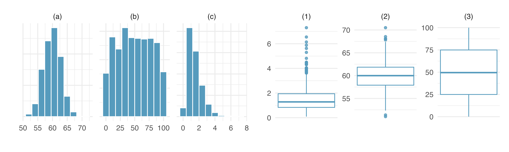
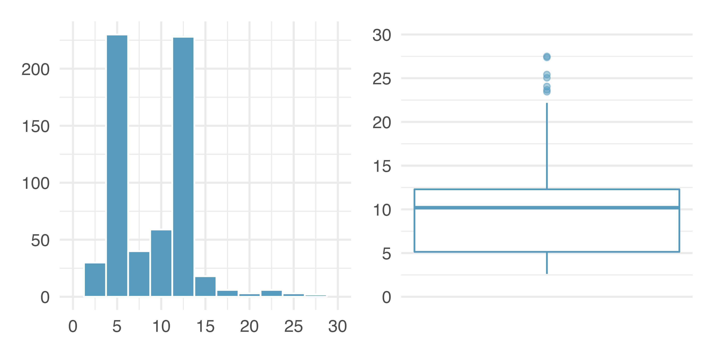

```{r setup, include=FALSE}
library(learnr)
library(openintro)
library(tidyverse)

set.seed(150)
mult <- .05
income <- rgamma(n = 10000, shape=50*mult, rate = .0007*mult)

income2 <- income + rlnorm(n=10000, mean= 0 , sd = .3)
retirement_age <- (-income2/max(income2) + 1)*79

sims <- tibble(income = income, retirement_age = retirement_age)

gradethis::gradethis_setup()
knitr::opts_chunk$set(echo = FALSE)
```


## Numerical Summary Statistics

Recall the following definitions:

* **mean**: \(\bar{x}=\frac{\sum_{i=1}^nx_i}{n}\). If we're talking about the population mean we write $\mu$.
* **median**: Point which splits your data in half. If there is an even number of data points the median is the average of the two data points in the center.
* **percentile** A $\alpha$ percentile is the point at which $\alpha\%$ of the data is below the percentile. The 25th, 50th, and 75th percentiles are called **quartiles** and denoted $Q_1, Q_2, Q_3$
* **mode**: sometimes defined as most common value. Better definition is any prominent peak when looking at a histogram or density plot.
* **variance**: \(s^2 = \frac{\sum_{i=1}^n (x_i - \bar{x})^2}{n-1}\). If we're talking about the population variance we write $\sigma^2$.
* **standard deviation**: Square root of variance.
* **Interquartile Range (IQR)**: $Q_3-Q_1$
* **unimodal** distributions with one mode.
* **bimodal** distributions with two modes.
* **multimodal** distributions with more than two modes.
* **outlier** points which are unusually high or low (many different way to define "unusually")

 
Suppose we have the following data: 0, 1, 2, 3, 4, 5, 6, 7, 8, 9, 10

In the console below, use R as a calculator to compute the mean, median, and interquartile range of this data. Don't use any built-in R functions other than addition and division.

```{r calculator-1, exercise=TRUE}

```


We'll now use R to compute the variance and standard deviation. First let's explore some R functionality that will be helpful. In the console below we define a vector named `x` with elements 0, 1, 2, and 3 and do some arithmetic with it. Notice how if we add, subtract, multiply, divide, or exponentiate by a single number it applies that operation to the whole vector.

```{r vector, exercise=TRUE}
# Define vector x
x <- c(0, 1, 2, 3)

# Addition/Subtraction
x - 3

# Multiplication/Divions
x/2

# Exponents
x^3


```

With this in mind, compute the variance and standard deviation of our set of numbers given above. Note that `sqrt` is the function for square root:

```{r var-sd, exercise=TRUE}
# Define vector
x <- 
print(x)

# Subtract mean to compute deviations
deviations <- 
print(deviations)

# Square deviations
dev_squared <-
print(dev_squared)
  
# Use the sum() function to sum up all the entries in dev_squared
sum_dev_squared <-
print(sum_dev_squared)
  
# Divide by n-1 to get variance
variance <- 
  
# Take square root to get standard deviation
standard_deviation <- 
  
# Print out variance and standard deviation
variance
standard_deviation
```

While this is "fun", R does provide functions that will do all of this for us:

```{r R-func, exercise=TRUE}
x <- c(0, 1, 2, 3, 4, 5, 6, 7, 8, 9, 10)

mean(x)
median(x)
IQR(x)
var(x)
sd(x)
```

Suppose we change the value 10 to 100 in our little data set.

```{r robust-qs}
question_checkbox("Select all statistics will increase as a result.",
               answer("mean", correct=TRUE),
               answer("median"),
               answer("IQR"),
               answer("variance", correct=TRUE),
               answer("standard deviation", correct=TRUE),
               allow_retry = TRUE)
```

This is because median and IQR are **robust statistics** meaning they aren't sensitive to outliers like the mean, variance, and standard deviation.

Suppose, instead of changing 10 to 100, we changed 0 to 100.

```{r robust-qs2}
question_checkbox("Select all statistics will increase as a result.",
               answer("mean", correct=TRUE),
               answer("median", correct=TRUE),
               answer("IQR"),
               answer("variance"),
               answer("standard deviation"),
               allow_retry = TRUE)
```

Suppose, instead of changing changed 0 to 100, we add 100 to every data point.

```{r robust-qs3}
question_checkbox("Select all statistics will increase as a result.",
               answer("mean", correct=TRUE),
               answer("median", correct=TRUE),
               answer("IQR"),
               answer("variance"),
               answer("standard deviation"),
               allow_retry = TRUE)
```

In the past two examples, we are increasing the center of our data but the overall spread doesn't change. This implies that the only statistics which will increase are the mean and median.

Suppose, instead of adding 100 to every data point, we multiply every data point by 10.

```{r robust-qs4}
question_checkbox("Select all statistics will increase as a result.",
               answer("mean", correct=TRUE),
               answer("median", correct=TRUE),
               answer("IQR", correct=TRUE),
               answer("variance", correct=TRUE),
               answer("standard deviation", correct=TRUE),
               allow_retry = TRUE)
```

Since we're increasing the center AND the spread all of the statistics will increase. 

Now consider the set of data: -5, -4, -3, -2, -1, 0, 1, 2, 3, 4, 5. We say that this data set is **symmetric**. Suppose we were to multiply every data point in this data set by 10.

```{r robust-qs5}
question_checkbox("Select all statistics will increase as a result.",
               answer("mean"),
               answer("median"),
               answer("IQR", correct=TRUE),
               answer("variance", correct=TRUE),
               answer("standard deviation", correct=TRUE),
               allow_retry = TRUE)
```

Since the data is symmetric around zero, when we multiply, every increase from a positive data point is matched by a corresponding decrease from a negative data point which causes the center to remain the same. As a result the only thing that increases is the spread of the data.

The console below has access to a data frame called `sims` which contains simulated data with variables `income` and `retirement_age`. Create a histogram for each variable. Experiment with different bandwidths to get a histogram which you feel accurately reflects to data without adding too much noise. **WARNING:** for `income` you will want to choose a binwidth of at least 1000 or R will take a very long time creating your histogram.


```{r skew, exercise=TRUE}
# income histogram

# retirement_age histogram

```

```{r skew-hint-1}
# income histogram
ggplot(sims, aes(x=____)) +
  _____(_____ = _____)

# retirement_age histogram

```

```{r skew-hint-2}
# income histogram
ggplot(sims, aes(x=____)) +
  geom_histogram(binwidth = _____)

# retirement_age histogram

```

```{r skew-hint-3}
# income histogram
ggplot(sims, aes(x=income)) +
  geom_histogram(binwidth = 15000)

# retirement_age histogram

```

```{r skew-qs}
quiz(
  question_checkbox(
    "Check all that apply to the distribution of the income variable?",
            answer("Left-Skewed"),
            answer("Right-Skewed", correct=TRUE),
            answer("Unimodal", correct=TRUE),
            answer("Bimodel"),
            answer("Multimodel"),
            allow_retry = TRUE
    ),

question_checkbox(
    "Check all that apply to the distribution of the reitrement_age variable?",
            answer("Left-Skewed", correct=TRUE),
            answer("Right-Skewed"),
            answer("Unimodal", correct=TRUE),
            answer("Bimodel"),
            answer("Multimodel"),
            allow_retry = TRUE
    )
)
```


```{r outliers-q}
question("Which of the following plots would be best for indicating whether `income` or `retirement_age` have outliers?",
         answer("histogram"),
         answer("density plot"),
         answer("box plot", correct=TRUE),
         answer("dot plot"),
         allow_retry=TRUE
         )
```


In the console below create box plots for both variables, `income` and `retirement_age`:

```{r boxplots, exercise=TRUE}
# box plot of income


# box plot of retirement_age


```

```{r boxplots-hint-1}
# box plot of income
ggplot(____, ___(_____)) +
  _____()

# box plot of retirement_age

```

```{r boxplots-hint-2}
# box plot of income
ggplot(____, aes(x = _____)) +
  geom_boxplot()

# box plot of retirement_age


```

```{r boxplots-hint-3}
# box plot of income
ggplot(sims, aes(x = income)) +
  geom_boxplot()

# box plot of retirement_age (you can repurpose the code for the previous plot)

```

Take a minute and discuss with your group some of the properties of the data you notice in your box plots.

There are two takeaways that I'd like to impress upon you with these plots:

1. For left-skewed data, we have a lot of data points which are much lower than the median. For right-skewed data, we have a lot of data points which are much higher than the median.
2. It is unlikely that we have SO MANY outliers. In fact, **there is no single agreed upon way to numerically define an outlier**. There are some heuristics. For example, the `geom_boxplot` function defines an outlier as anything which is more than \(1.5\times IQR\) above $Q_3$ or below $Q_1$. However, as we can see above, this is NOT a good heuristic when we have heavily skewed data. In practice, you will want to use a variety of techniques (e.g. histograms, box plots, scatter plots) and **knowledge about how your data was created** in order to determine if you have outliers in your data.

Keeping the first point above in mind and using our knowledge of robust statistics:

```{r mean-median-q}
quiz(
  question("Which do you expect to be larger?",
           answer("Mean Income", correct=TRUE),
           answer("Median Income"),
           allow_retry=TRUE),
  question("Which do you expect to be larger?",
           answer("Mean Retirement Age"),
           answer("Median Retirement Age", correct=TRUE),
           allow_retry=TRUE)
)
```

In the console below, use the `summarize` function to compute the mean and median of both variables to verify our answers above:

```{r mean-median, exercise=TRUE}

```

```{r mean-median-hint-1}
sims %>%
  summarize(
    mean_income = _____,
    median_income = ______,
    mean_retirement = ______,
    median_retirement = ______
  )
```

```{r mean-median-hint-2}
sims %>%
  summarize(
    mean_income = mean(_____),
    median_income = median(_____),
    mean_retirement = ______,
    median_retirement = ______
  )
```

```{r mean-median-hint-3}
sims %>%
  summarize(
    mean_income = mean(_____),
    median_income = median(_____),
    mean_retirement = ______,
    median_retirement = ______
  )
```


```{r mean-median-hint-4}
sims %>%
  summarize(
    mean_income = mean(income),
    median_income = median(income),
    mean_retirement = ______,
    median_retirement = ______
  )
```

It's true! In fact, this will be true in general and you can include the mode if you want:

{width=100%}

## Make-up exam.

This is the beginning of your homework. When you're done, you may either upload a pdf of this to Moodle or enter your answers in [this google form](https://forms.gle/R49BHkuMDhz4DYn96). If you choose to upload your answers to moodle make sure all of your answers are showing.

In a class of 25 students, 24 of them took an exam in class and 1 student took a make-up exam the following day. The professor graded the first batch of 24 exams and found an average score of 74 points with a standard deviation of 8.9 points. The student who took the make-up the following day scored 64 points on the exam.

1. Does the new student’s score increase or decrease the average score?

```{r class-q-a, exercise=TRUE}
#
```

```{r class-q-a-solution}
# Since the new score is smaller than the mean of the 24 previous scores, the new mean should be smaller than the old mean.
```

2. What is the new average? You may want to use a pen and paper. (Solution on the next tab)

```{r class-q-b, exercise=TRUE}
#
```

3. Do you think the new student’s score will increase or decrease the standard deviation of the scores? Use your intuition.

```{r class-q-c, exercise=TRUE}
#
```

```{r class-q-c-solution}
# The new score, 64, is more than 1 standard deviation away from the previous mean, and this will tend to increase the standard deviation of the data. While possible, it is mathematically tedious to calculate the new standard deviation.
```

## Make-up exam part 2 solution.

We are given that $n=24$, $\bar{x}=74$, and $s_x=8.9$.
\begin{aligned}
\bar{x} &= \frac{x_1 + x_2 + \dots + x_{24}}{24} = 74\\
x_1 + x_2 + \dots + x_{24} &= 74 * 24 = 1776\\
x_1 + x_2 + \dots + x_{24} + x_{25} &= 1776 + 64 = 1840\\
\bar{x}_{new} &= \frac{x_1 + x_2 + \dots+x_{24} + x_{25}}{25}=\frac{1840}{25} = 73.6\end{aligned}

## Histograms and box plots.
Describe (in words) the distribution in the histograms below and match them to the box plots.
{width=100%}

```{r box-v-hist, exercise=TRUE}
#
```

```{r box-v-hist-solution}
# The distribution is unimodal and symmetric, and about 95% of the data falls
# within about 7 units of the center, so the standard deviation will be about
# 3 or 4. This matches box plot 2.

# The distribution is uniform and values range from 0 to 100. This matches box
# plot 3 which shows a symmetric distribution in this range. Also, each 25%
# chunk of the box plot has about the same width and there are no suspected outliers.

# The distribution is unimodal and right skewed with a median between 1 and 2.
# 25th and 75th percentile are near 1 and 2, so the IQR is roughly 1. This
# matches box plot 1.
```


##  Histograms vs. box plots.

Compare the two plots below. What characteristics of the distribution are apparent in the histogram and not in the box plot? What characteristics are apparent in the box plot but not in the histogram?

{width=100%}

```{r box-v-hist2, exercise=TRUE}
#
```

```{r box-v-hist2-solution}
# The histogram shows that the distribution is bimodal, which is not apparent
# in the box plot. The box plot makes it easy to identify more precise values
# of observations outside of the whiskers.
```

## Facebook friends

Facebook data indicate that 50% of Facebook users have 100 or more friends, and that the average friend count of users is 190. What do these findings suggest about the shape of the distribution of number of friends of Facebook users? (Backstrom 2011)

```{r facebook, exercise=TRUE}
#
```

```{r facebook-solution}
# The statement “50% of Facebook users have over 100 friends” means that the
# median number of friends is 100, which is lower than the mean number of
# friends (190), which suggests a right skewed distribution for the number of
# friends of Facebook users.
```


## Distributions and appropriate statistics.

For each of the following, state whether you expect the distribution to be symmetric, right skewed, or left skewed. Also specify whether the mean or median would best represent a typical observation in the data, and whether the variability of observations would be best represented using the standard deviation or IQR. Explain your reasoning.

a) Number of pets per household.

b) Distance to work, i.e., number of miles between work and home.

c) Heights of adult males.

d) Age at death.

e) Exam grade on an easy test.

```{r symmetric, exercise=TRUE}
# a)

# b)

# c)

# d)

# e)
```

```{r symmetric-solution}
# a) The distribution of number of pets per household is likely right skewed as
# there is a natural boundary at 0 and only a few people have many pets.
# Therefore the center would be best described by the median, and variability
# would be best described by the IQR.


# b) The distribution of number of distance to work is likely right skewed as
# there is a natural boundary at 0 and only a few people live a very long distance
# from work. Therefore the center would be best described by the median, and
# variability would be best described by the IQR.

# c) The distribution of heights of males is likely symmetric. Therefore the
# center would be best described by the mean, and variability would be best
# described by the standard deviation.

# d) The distribution of age at death is likely left skewed. Therefore the
# center would be best described by the median, and variability would be best
# described by the IQR.

# e)The distribution of exam grade on an easy test is likely left skewed.
# Therefore the center would be best described by the median, and variability
# would be best described by the IQR.
```

## A new statistic

The statistic $\frac{\bar{x}}{median}$ can be used as a measure of skewness. Suppose we have a distribution where all observations are greater than 0, $x_i > 0$. What is the expected shape of the distribution under the following conditions? Explain your reasoning.

a. $\frac{\bar{x}}{median} = 1$
b. $\frac{\bar{x}}{median} < 1$
c. $\frac{\bar{x}}{median} > 1$

```{r new-stat, exercise=TRUE}
# a)

# b)

# c)
```

```{r new-stat-solution}
# a)  This is most likely to be the case for symmetric distributions.

# b) Left skewed. When a distribution is left-skewed the mean will be less
#  than the median.

# c) Right skewed. When a distribution is right-skewed the mean will be greater
#  than the median.
```

## Submit

```{css echo=FALSE}
@media print {
  .topicsContainer,
  .topicActions,
  .exerciseActions .skip {
    display: none;
  }
  .topics .tutorialTitle,
  .topics .section.level2,
  .topics .section.level3:not(.hide) {
    display: block;
  }
  .topics {
    width: 100%;
  }
  .tutorial-exercise, .tutorial-question {
    page-break-inside: avoid;
  }
  .section.level3.done h3 {
    padding-left: 0;
    background-image: none;
  }
  .topics .showSkip .exerciseActions::before {
    content: "Topic not yet completed...";
    font-style: italic;
  }
}
```

Make sure you have the tutorial open in a browser (preferably Google Chrome). Please press `print page` button below to print the tutorial. Make sure to print it to a `pdf` file and upload it into Moodle.

```{js print2pdf1, context="server"}
    // the following 2 chunks print the completed sections of the tutorial to PDF
    // uses "css/print2pdf.css"
    $(document).on('shiny:inputchanged', function(event) {
      if (event.name === 'print2pdf') {
        window.print();
      }
    });
    ```
    
```{r print2pdf2}
    # button can be placed anywhere in the tutorial
    actionButton("print2pdf", "Print page", style="opacity: .7; color: #000;")
```