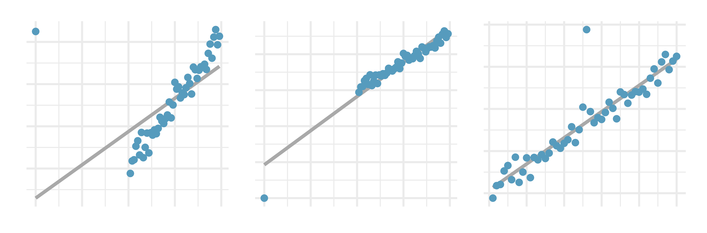

```{r setup, include=FALSE}
library(learnr)
library(openintro)
library(tidyverse)
library(tidymodels)

gradethis::gradethis_setup()
knitr::opts_chunk$set(echo = FALSE)
```


## Part 1

### Correlation

We are going to start today's lesson by going over correlation. Recall that the formula for correlation is \[r=\frac{\sum(x_i-\bar{x})(y_i-\bar{y})}{\sqrt{\sum(x_i-\bar{x})^2\sum(y_i-\bar{y})^2}}\]
where the the $x_i$s are observations for your first variable and $y_i$ are the observations for your second variable.

For the first part of our lesson we're going to be using the data set `corr_match`. In the console below, take a look at the data set to get a good impression about what the data looks like. What are the dimensions? What are the names of the variables?

```{r sandbox, exercise=TRUE}

```

We're going to be looking at how the variable `x` correlates with the other variables. In the console below, please create a scatter plot of `x` and `y1`:

```{r first-scat, exercise=TRUE}
ggplot(data = ____, aes(x = ____, y = ____)) +
  geom_point()
```

Based on this scatter plot, estimate the correlation coefficient between `x` and `y1` (don't write any code in this part, just a comment with your best guess):

```{r first-cor-guess, exercise=TRUE}
# 
```

Now use R to compute the true correlation coefficient between `x` and `y`:

```{r first-cor, exercise=TRUE}
corr_match %>%
  summarize(cor(____, ____))
```

Was your guess close? If not, why?

```{r first-ref, exercise=TRUE}
# 
```

We are going to repeat this process for the other variables. In the console's below, please repeat this process for each `y2` through `y8`. Please keep track of your answer using a piece of paper or text editor:

Scatter plot:

```{r sec-scat, exercise=TRUE}

```

Guess of correlation coefficient:

```{r sec-cor-guess, exercise=TRUE}
# 
```

Actual correlation coefficient:

```{r sec-cor, exercise=TRUE}

```

Was your guess close? If not, why?

```{r sec-ref, exercise=TRUE}
# 
```

### Line Fitting

We're now going to focus on the data set `bdims`. Run the console below to display the metadata for `bdims`:

```{r bdims-help, exercise=TRUE}
?bdims
```

Let's suppose you're creating a model to help people figure out what size shirt they should try-on, based on their height. We'll be trying to model chest diameter (`che_di`) as a function of height (`hgt`). In the console below, create a scatter plot with `hgt` on the x-axis and `che_di` on the y-axis:

```{r bdims-scatter, exercise=TRUE}

```


We'd like to fit a line of the form $y=b_0 + b_1x$ to this data. In the console below adjust `b1` (the slope of your line) and `b` the y-intercept until you find a line which visually seems to fit the data well (be careful and make small changes until you get a line you like):

```{r visual-line-fit, exercise=TRUE}
b0 <- 57
b1 <- -.5

ggplot(bdims, aes(x=hgt, y=che_di)) +
  geom_point() +
  geom_abline(intercept = b0, slope = b1, color="red")
```

In the console below use the line above to create a new column in the `bdims` data set called `y_pred` that contains the predicted values of `y`. Then create another column called `residuals`
with the residuals from your model. You should be able to use one mutate function to do both of these calculations even though `residuals` will depend on `y_pred`. Finally, create a scatter plot with `hgt` on the x-axis and `residuals` on the y-axis. Play around with the values of `b1` and `b0` to see if you can find a line which you think fits the data better (i.e. results in smaller residuals):


```{r residuals-line-fit, exercise=TRUE}
b0 <- .5
b1 <- -57

# Use mutate to add y_pred and residuals column to bdims


# Create scatter plot of hgt and residuals


```


With your group, take 5-10 minutes to think of a more rigorous criterion for evaluating how well a line fits the data. You will be asked to share your method with the class.


In the console below, use your criteria to evaluate how well your chosen line is working. If you'd like to play around with your values of `b0` and `b1` to find a better fitting line, go for it:

```{r line-eval, exercise=TRUE}
b0 <- .5
b1 <- -57

# Copy your code from above (which creates y_pred and residuals) here


# Evaluate the fit of your line (mutate and summarize will likely be useful here)


```


## Part 2

Let's revisit our problem from last time. We were attempting to predict chest diameter (`che_di`) from height (`hgt`) using linear regression on the `bdims` data set. In the console below create a scatter plot with height on the x-axis and chest diameter on the y-axis:

```{r bdims-scatter-2, exercise=TRUE}

```

Now lets use least-squares regression to fit a line to this data. Recall that the formulas for the slope and intercept for a least-squares regression line are:

\[b_1 = \frac{s_y}{s_x}r, \qquad b_0 = \bar{y} - b_1\bar{x}\]

```{r x-v-y}
question("In our scenario, which variable is $y$ and which variable is $x$",
         answer("$x$-height, $y$-chest diameter", correct=TRUE),
         answer("$y$-height, $x$-chest diameter"),
         allow_retry= TRUE)
```

In the console below, compute $\bar{x}$, $\bar{y}$, $s_y$, $s_x$, and $r$. The `summarize` function coupled with `sd`, `mean`, and `cor` will be useful:

```{r summary-stats, exercise=TRUE}

```

Now, using R as a calculator, compute the least squares intecept and slope, $b_0$ and $b_1$:

```{r calculator, exercise=TRUE}


```

Plug your answers in for `b0` and `b1` below to create the same scatter plot with red line that you did during last lesson:

```{r visual-line-fit-2, exercise=TRUE}
b0 <- 
b1 <- 

ggplot(bdims, aes(x=hgt, y=che_di)) +
  geom_point() +
  geom_abline(intercept = b0, slope = b1, color="red")

bdims <- bdims %>%
  mutate(
    y_pred = b0 + b1 * hgt,
    residuals = che_di - y_pred
  )

ggplot(bdims, aes(x=hgt, y=residuals)) +
  geom_point()
```

Compare the line you've created here to the line you estimated visually last class:

```{r comparison, exercise=TRUE}
# 
```

Suppose a customer walks into a store looking to try on a suit. He says that he is 180 cm tall. Use R below as a calculator to estimate his chest diameter:

```{r predict-brute, exercise=TRUE}

```

Now... this is tedious and, as you know from your pre-work, R has a built in function called `lm` for performing least-squares regression. In the console below, perform the same least squares regression as above using the `lm` function. Store the resulting `lm` object in a variable called `bdims_mod` and use the `summary` function to print out a summary of the model:

```{r lm-bdims, exercise=TRUE}

```

This summary gives as A LOT of information about the model. We don't know what most of those number mean but we can identify some useful ones already. First notice the intercept and slope terms. Are they the same as the ones you estimated earlier? Next notice that it gives us a number called `Multiple R-squared`. This is the same $R^2$ that we've learned about and R automatically computes it for us! What is the value of $R^2$? How much of the variation in chest dimension can be explained by height?

```{r lm-bdims-qs, exercise=TRUE}
#
```

Now use the `predict` function and your `bdims_mod` object to predict the height of your 180cm tall gentleman. Remember that you'll have to create a new data frame with your new data in it:

```{r predict-lm-setup}
bdims_mod <- lm(che_di ~ hgt, data = bdims)
```

```{r predict-lm, exercise=TRUE}

```

```{r predict-lm-hint-1}
new_data <- data.frame(____ = _____)

predict(_____, newdata = _____)
```

```{r predict-lm-hint-2}
new_data <- data.frame(hgt = _____)

predict(_____, newdata = _____)
```

Now suppose you have a whole list of individuals for whom you need to provide estimates of chest diameter. In the console below, the `new_data` data frame contains the heights of 100 customers. In the same way as you just did, create predictions for all of these 100 customers:

```{r predict-lm-2-setup}
bdims_mod <- lm(che_di ~ hgt, data = bdims)

set.seed(100)
new_data <- data.frame(hgt = runif(100, 150, 190))
```

```{r predict-lm-2, exercise=TRUE}

```


### Outliers

We're now going to explore outliers for a little bit. Running the console below will create a scatter plot of the same data we've been using with the least-squares regression line added:

```{r outlier-1, exercise=TRUE}
ggplot(bdims, aes(x=hgt, y=che_di)) +
  geom_point() +
  geom_smooth(method="lm", se=FALSE)
```

Suppose someone in the `bdims` data set has a congenital disorder that causes them to be extremely small. Please do the following:

1. Run the console below.
2. Find the outlier and discuss with your group whether it is high-leverage.
3. Uncomment the `geom_smooth` command, add a `+` after `geom_point()`, and re-run the code.
4. Do you think the outlier is influential? Would you feel comfortable removing this outlier?

```{r outlier-2-setup}
bdims <- bdims %>%
  add_row(hgt = 40, che_di = 24)
```


```{r outlier-2, exercise=TRUE}
ggplot(bdims, aes(x=hgt, y=che_di)) +
  geom_point() 
#  geom_smooth(method="lm", se=FALSE)
```

Now suppose Giannis Antetokounmpo is in the `bdims` data set. Please do the following:

1. Run the console below.
2. Find the outlier and discuss with your group whether it is high-leverage.
3. Uncomment the `geom_smooth` command, add a `+` after `geom_point()`, and re-run the code.
4. Do you think the outlier is influential? Would you feel comfortable removing this outlier?

```{r outlier-3-setup}
bdims <- bdims %>%
  add_row(hgt = 211, che_di = 44)
```


```{r outlier-3, exercise=TRUE}
ggplot(bdims, aes(x=hgt, y=che_di)) +
  geom_point() 
#  geom_smooth(method="lm", se=FALSE)
```

Finally, assume you are looking at this data and you notice an outlier. Please do the following:

1. Run the console below.
2. Find the outlier and discuss with your group whether it is high-leverage.
3. Uncomment the `geom_smooth` command, add a `+` after `geom_point()`, and re-run the code.
4. Do you think the outlier is influential? 
5. You look into the issue more deeply and find that the person entering data likely made an error. Would you feel comfortable removing this outlier?

```{r outlier-4-setup}
bdims <- bdims %>%
  add_row(hgt = 170, che_di = 3.3)
```


```{r outlier-4, exercise=TRUE}
ggplot(bdims, aes(x=hgt, y=che_di)) +
  geom_point() 
#  geom_smooth(method="lm", se=FALSE)
```

This is actually a pretty common occurance... People mis-type things all the time. If you can figure out what went wrong, you can fix it. If not, you'll have to remove the data point from your data set.

## Trends in the residuals. 

This is the first question of your homework. Feel free to upload it as a PDF to moodle or copy and past your answers into this [google form](https://forms.gle/9EujHUG6K2QaWNkCA).

Shown below are two plots of residuals remaining after fitting a linear model to two different sets of data. For each plot, describe important features and determine if a linear model would be appropriate for these data. Explain your reasoning.

```{r trends-residuals, exercise=TRUE}
#
```

```{r trends-residuals-solution}
# There is a fan shape in the residual plot. Variability around the regression line increases as ŷ  increases. Since there is a trend in the residual plot, a linear mode  using the methods we have described would not be appropriate for these data.

# There is an apparent curvature in the residual plot. A linear model would not be appropriate for these data.
```


## Over-under, II. 

Suppose we fit a regression line to predict the number of incidents of skin cancer per 1,000 people from the number of sunny days in a year. For a particular year, we predict the incidence of skin cancer to be 1.5 per 1,000 people, and the residual for this year is 0.5. Did we over or under estimate the incidence of skin cancer? Explain your reasoning.

```{r over-under, exercise=TRUE}
#
```

```{r over-under-solution}
# Under-estimate. Since the residual is calculated as observed−predicted, a positive residual means that the predicted value is lower than the observed value.
```


## Starbucks, calories, and carbs. 

Since Starbucks only lists the number of calories on the display items, we might be interested in predicting the amount of carbs a menu item has based on its calorie content. The data set `starbucks` contains information about the nutrition of several Starbucks items.

In the console below create a scatter plot with the number of calories on the x-axis and the number of carbs on the y-axis:

```{r starbucks-1, exercise=TRUE}

```

```{r starbucks-1-hint}
ggplot(starbucks, aes(x=____, y=_____)) +
  geom_point()
```

In the console below, use the `lm` function to fit a least-squares regression line to this data with `calories` as the predictor variable and `carb` as the outcome variable". Then use the `summary` function to print out a summary of the model:

```{r starbucks-lm, exercise=TRUE}
# Create model here (don't forget to assign it to a variable)


# Print out summary here
```

```{r starbucks-lm-hint-1}
starbucks_mod <- lm(_____ ~ ______, data = _____)
```


```{r starbucks-lm-hint-2}
starbucks_mod <- lm(_____ ~ ______, data = _____)

summary(_____)
```

What is the slope, y-intercept, and $R^2$ of your regression line? What proportion of the variability in `carb` is explained by `calories`?

```{r starbucks-lm-q1, exercise=TRUE}
# slope:

# y-intercept:

# R-squared:

# What proportion?
```

```{r starbucks-lm-q1-solution}
# slope: 0.10603

# y-intercept: 8.94356

# R-squared: .4556

# What proportion? 45.56%

```

In the console below create a residual plot by:
1. Using the `augment` function to get the residuals from our model into a data frame. Note that the linear model object is called `starbucks_mod` in the chunk below.
2. Create a scatter plot with `calories` on the x-axis and `.resid` on the y-axis.

```{r residuals-setup}
starbucks_mod <- lm(carb ~ calories, data = starbucks)
```

```{r residuals, exercise=TRUE}

```


```{r residuals-hint-1}
starbucks_mod_aug <- starbucks_mod %>%
  augment()
```

```{r residuals-hint-2}
starbucks_mod_aug <- starbucks_mod %>%
  augment()

ggplot(data = _____, aes(x = _____, y=_____)) +
  geom_point()
```

What does the residuals vs. predicted plot tell us about the variability in our prediction errors based on this model for items with lower vs. higher predicted carbs?

```{r resdiaul-q, exercise=TRUE}
#
```

```{r resdiaul-q-solution}
# Food menu items with higher predicted carbs are predicted with higher variability than those without, suggesting that the model is doing a better job predicting protein amount for food menu items with lower predicted proteins.
```

## Body measurements, regression. 

Researchers studying anthropometry collected body and skeletal diameter measurements, as well as age, weight, height and sex for 507 physically active individuals. This data is stored in the `bdims` data frame. In the console below, create a scatter plot with shoulder girth on the x-axis and height on the y-axis.

```{r bdim-scatter-hw, exercise=TRUE}

```

Now fit a least-squares regression line using the `lm` function. Store your `lm` object in a variable called `bdims_mod`. Use the `summary` function print out a summary of your model.

```{r bdims-lm-hw, exercise=TRUE}

```

What are the slope, y-intercept, and $R^2$ value for this line?

```{r bdims-lm-q, exercise=TRUE}
# Slope:

# y-intercept:

# R-squared:
```

How would $R^2$ change if we were to measure shoulder girth in feet rather than centimeters? Hint: there's not need to write any code for this part.

```{r bdims-lm-q-2, exercise=TRUE}
# 
```

```{r bdims-lm-q-2-solution}
# It wouldn't change at all. R-squared is agnostic to units.
```


Create a residual plot in the console below. Note that you can re-purpose much of the code from the Starbucks exercise. Remember that the `lm` object is called `bdims_mod`:

```{r bdims-resid-hw-setup}
bdims_mod <- lm(hgt ~ sho_gi, data = bdims)
```

```{r bdims-resid-hw, exercise=TRUE}

```

Do you notice any patterns in your residual plot?

```{r bdims-resid-hw-q, exercise=TRUE}
# 
```

```{r bdims-resid-hw-q-solution}
# Nope
```


Using the `predict` function, predict the height of a new student whose shoulder girth is 100cm. You need to first create a new data frame containing your new data and then use that data frame with the `predict` function:

```{r bdims-predict-hw-setup}
bdims_mod <- lm(hgt ~ sho_gi, data = bdims)
```

```{r bdims-predict-hw, exercise=TRUE}

```

```{r bdims-predict-hw-hint-1}
new_data <- data.frame(_____ = _____)
```

```{r bdims-predict-hw-hint-2}
new_data <- data.frame(sho_gi = 100)

predict(bdims_mod, newdata = _____)
```


## Outliers, II. 

Identify the outliers in the scatterplots shown below and determine what type of outliers they are. Explain your reasoning.

{width=100%}
```{r outlier-hw-q, exercise=TRUE}
# a)

# b)

# c)
```

```{r outlier-hw-q-solution}
# a) The outlier is in the upper-left corner. Since it is horizontally far from 
# the center of the data, it is an influential point. Additionally, since the 
# fit of the regression line is greatly influenced by this point, it is a point 
# with high leverage.

# b) The outlier is located in the lower-left corner. It is horizontally far 
# from the rest of the data, so it is a high-leverage point. The regression 
# line also would fall relatively far from this point if the fit excluded this 
# point, meaning it the outlier is influential.

# c) The outlier is in the upper-middle of the plot. Since it is near the 
# horizontal center of the data, it is not a high-leverage point. This means it 
# also will have little or no influence on the slope of the regression line.
```


