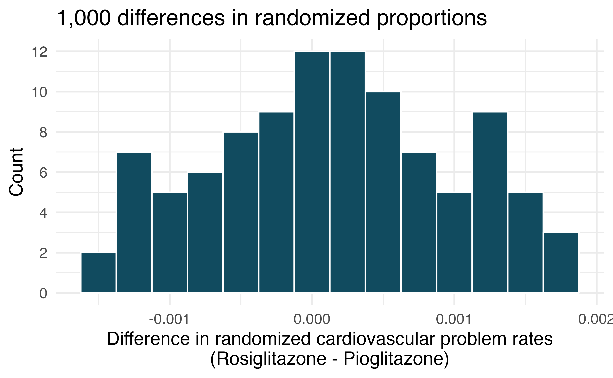

```{r setup, include=FALSE}
library(learnr)
library(openintro)
library(tidyverse)
library(infer)

covid <- read_csv("https://raw.githubusercontent.com/EricFriedlander/MATH221SP22/main/Datasets/simpsons_paradox_covid.csv") 

covid_under_50 <- covid %>%
  filter(age_group == "under 50")

covid_50_plus <- covid %>%
  filter(age_group == "50 +")

covid_50_plus_replicates <- covid_50_plus %>%
  specify(outcome~vaccine_status, success = "death") %>%
  hypothesize(null = "independence") %>%
  generate(reps = 1000, type = "permute") %>%
  calculate(stat = "diff in props", order = c("vaccinated", "unvaccinated")) 

covid_under_50_replicates <- covid_under_50 %>%
  specify(outcome~vaccine_status, success = "death") %>%
  hypothesize(null = "independence") %>%
  generate(reps = 1000, type = "permute") %>%
  calculate(stat = "diff in props", order = c("vaccinated", "unvaccinated")) 

gradethis::gradethis_setup()
knitr::opts_chunk$set(echo = FALSE)
```


## Vaccine efficacy against Delta Variant

We're going to be looking at the same data set on COVID-19 cases from the UK. We're going to use randomization testing in order to determine whether the vaccine is effective at reducing the mortality of individuals in two age buckets: `under 50` and `50 +`. You can find the data for those under 50 in the data frame `covid_under 50` and the data for those over 50 in the data frame `covid_50_plus`. We have TWO main research questions today:

> **Question 1**: Is the COVID-19 vaccine effective and preventing death from the Delta Variant in individuals above the age of 50?

> **Question 2**: Is the COVID-19 vaccine effective and preventing death from the Delta Variant in individuals below the age of 50?

Let's start be taking a quick look at our data. In the console below, create a contingency table containing counts with `vaccine_status` as the rows and `outcome` as the columns using `covid_50_plus`. Remember:

1. Pipe `covid_50_plus` into `count` making sure to count both `outcome` and `vaccine_status`.
2. Pipe the result into `pivot_wider` setting `outcome` as the columns by using the `names_from` parameter and setting `values_from` to use `n`.

```{r contingency-1, exercise=TRUE}

```

Now do the same but with the `covid_under_50` data set:

```{r contingency-2, exercise=TRUE}

```

We are trying to estimate the parameter $p_{vax}-p_{unvax}$ where $p_{vax}$ represents the proportion of vaccinated individuals that pass away from COVID and $p_{unvax}$ represents the proportion of unvaccinated individuals that pass away from COVID. In the console below create a contingency table of proportions where the rows sum to one based on the `covid_50_plus` data set. Make sure to put `vaccine_status` in the rows and `outcome` in the columns. Remember the procedure is:

1. Pipe `covid_50_plus` into `group_by` where you group by `vaccine_status`.
2. Pipe the result into `count` making sure to count both `outcome` and `vaccine_status`.
3. Pipe the result into `mutate` makes sure to compute that `proportion` as `n/sum(n)`.
4. Pipe the result into `pivot_wider` setting `outcome` as the columns by using the `names_from` parameter and setting `values_from` to use `proportion`. Don't forget to include the `id_cols` parameter and specify `c(vaccine_status, outcome, proportion)`.

```{r contingency-3, exercise=TRUE}

```

What is the **point estimate** for our parameter of interest in the older age group:

```{r point-1, exercise=TRUE}
#
```


In the console below, create the same contingency table but use the data set `covid_under_50`:

```{r contingency-4, exercise=TRUE}

```

What is the **point estimate** for our parameter of interest in the younger age group:

```{r point-2, exercise=TRUE}
#
```

Now let's conduct a hypothesis test to test our research questions.

In the console below or on a sheet of paper write down the null and alternative hypotheses for both research questions. Please include your hypotheses in words and formulas:

```{r hypotheses, exercise=TRUE}
# Question 1
# H0:
# HA: 

# Question2
#H0:
#HA:
```

In the console below, create 1,000 randomized replicates of the test statistic $\hat{p}_{vax}-\hat{p}_{unvax}$ with the response variable randomized in the over 50 case. To do this:

1. Pipe `covid_50_plus` into `specify`. Specify `outcome~vaccine_status` and `success = "death"`.
2. Pipe the result into `hypothesize` and specify `null="independence"`.
3. Pipe the result into `generate` and specify `reps=1000` and `type="permute"`.
4. Pipe the result into `calculate` and specify `stat = "diff in props"` and `order = c("vaccinated", "unvaccinated")`.
5. Make sure to save your result by adding `covid_50_plus_replicates <- ` at the beginning of the first line. Note that this will not print anything else. If you'd like to take a look at the data frame you've created you can use `glimpse` or `head`.

```{r create-reps, exercise=TRUE}

```

```{r create-reps-hint-1}
covid_50_plus_replicates <- covid_50_plus %>%
  specify(____ ~ ____, success = ____) %>%
  hypothesize(null = _____) %>%
  generate(reps = _____, type = _____) %>%
  calculate(stat = _____, order = _____) 
```

```{r create-reps-hint-2}
covid_50_plus_replicates <- covid_50_plus %>%
  specify(outcome~vaccine_status, success = "death") %>%
  hypothesize(null = "independence") %>%
  generate(reps = 1000, type = "permute") %>%
  calculate(stat = "diff in props", order = c("vaccinated", "unvaccinated")) 
```

In the console below, calculate the 5\% quantile of this distribution. To do this pipe `covid_50_plus_replicates` into `summarize` and specify `q.05 = quantile(stat, probs = .05)`:

```{r quantiles-1, exercise=TRUE}

```

```{r quantiles-1-hint-1}
covid_50_plus_replicates %>%
  summarize(_____ = ______)
```

```{r quantiles-1-hint-2}
covid_50_plus_replicates %>%
  summarize(q.05 = quantile(stat, probs = 0.05))
```

Note use `covid_50_plus_replicates` to create a histogram of your replicates. Note that the variable containing that these statistics is called `stat`. Don't forget to adjust the `binwidth`. Add a vertical red line to the plot where the 5th percentile is by adding the following layer `geom_vline(aes(xintercept=_____), color="red")` where `_____` is replaced by the quantile you computed in the previous step.

```{r create-hist-1, exercise=TRUE}

```

The region to the left of the red line is called the **critical region**. If our test statistic falls in the critical region we reject the null in favor of the alternative hypothesis. What is the outcome of our hypothesis test? 

```{r hypothesis-test-outcome-1, exercise=TRUE}
#
```

The **p-value** of a test is the probability of getting a test statistic that is at least as extreme as our test statistic. You can compute this by computing the proportion of our replicates that fall further to the left than the test statistic. What is the p-value for this test (you should be able to easily do this in your head):

```{r p-value-1, exercise=TRUE}
#
```

We now going to repeat this analysis for the under 50 group.

In the console below, create 1,000 randomized replicates of the test statistic $\hat{p}_{vax}-\hat{p}_{unvax}$ with the response variable randomized in the under 50 case. Store your result in a data frame called `covid_under_50_replicates`

```{r create-reps-2, exercise=TRUE}

```

In the console below, calculate the 5\% quantile of this distribution.

```{r quantiles-2, exercise=TRUE}

```

Note use `covid_50_plus_replicates` to create a histogram of your replicates. Note that the variable containing that these statistics is called `stat`. Don't forget to adjust the `binwidth`. Add a vertical red line to the plot where the 5th percentile is by adding the following layer `geom_vline(aes(xintercept=_____), color="red")` where `_____` is replaced by the quantile you computed in the previous step.

```{r create-hist-2, exercise=TRUE}

```

What is the outcome of our hypothesis test? 

```{r hypothesis-test-outcome-2, exercise=TRUE}
#
```

What is the p-value for this test (you can use the code below)?

```{r p-value-2, exercise=TRUE}
covid_under_50_replicates %>%
  summarize(mean(stat < -9.1342e-05))
```

## Hypotheses.

For each of the research statements below, note whether it represents a null hypothesis claim or an alternative hypothesis claim.

1. The number of hours that grade-school children spend doing homework predicts their future success on standardized tests.
2. King cheetahs on average run the same speed as standard spotted cheetahs.
3. For a particular student, the probability of correctly answering a 5-option multiple choice test is larger than 0.2 (i.e., better than guessing).
4. The mean length of African elephant tusks has changed over the last 100 years.
5. The risk of facial clefts is equal for babies born to mothers who take folic acid supplements compared with those from mothers who do not.
6. Caffeine intake during pregnancy affects mean birth weight.
7. The probability of getting in a car accident is the same if using a cell phone than if not using a cell phone.

```{r hypotheses-hw, exercise=TRUE}
# 1:

# 2:

# 3:

# 4:

# 5:

# 6:

# 7:

```

```{r hypotheses-hw-solution}
# 1: Alternative

# 2: Null

# 3: Alternative

# 4: Alternative

# 5: Null

# 6: Alternative

# 7: Null

```

## True null hypothesis. 

Unbeknownst to you, let’s say that the null hypothesis is actually true in the population. You plan to run a study anyway.

1. If the level of significance you choose (i.e., the cutoff for your p-value) is 0.05, how likely is it that you will mistakenly reject the null hypothesis?


2. If the level of significance you choose (i.e., the cutoff for your p-value) is 0.01, how likely is it that you will mistakenly reject the null hypothesis?

3. If the level of significance you choose (i.e., the cutoff for your p-value) is 0.10, how likely is it that you will mistakenly reject the null hypothesis?

```{r hypotheses-hw-2, exercise=TRUE}
# 1:

# 2

# 3:

```

```{r hypotheses-hw-2-solution}
# 1: If the null hypothesis is true, the probability of mistakenly reject H0 is 0.05.

# 2: If the null hypothesis is true, the probability of mistakenly reject H0 is 0.01.

# 3: If the null hypothesis is true, the probability of mistakenly reject H0 is 0.10.

```

## Identify hypotheses, II. 

Write the null and alternative hypotheses in words and using symbols for each of the following situations.

1. Since 2008, chain restaurants in California have been required to display calorie counts of each menu item. Prior to menus displaying calorie counts, the average calorie intake of diners at a restaurant was 1100 calories. After calorie counts started to be displayed on menus, a nutritionist collected data on the number of calories consumed at this restaurant from a random sample of diners. Do these data provide convincing evidence of a difference in the average calorie intake of a diners at this restaurant?

2. Based on the performance of those who took the GRE exam between July 1, 2004 and June 30, 2007, the average Verbal Reasoning score was calculated to be 462. In 2021 the average verbal score was slightly higher. Do these data provide convincing evidence that the average GRE Verbal Reasoning score has changed since 2021?

```{r hypotheses-hw-3, exercise=TRUE}
# 1:

# 2:


```

```{r hypotheses-hw-3-solution}
# H0:μ=1100 (The current average calorie intake is 1100 calories)
# HA:μ≠1100 (The current average calorie intake is different than 1100 calories.) Note: we use a two-sided test because we would be very interested in identifying an increase, not just a decrease, even if a decrease is what we hoped to find. If we used a one-sided test with μ<1100, we would not be statistically justified in pointing out an increase, even if it was an extremely obvious increase.

# H0:μ=462 (The current average Verbal Reasoning score is 462)
# HA:μ≠462 (The current average Verbal Reasoning score is not 462)

```

## Side effects of Avandia. 

Rosiglitazone is the active ingredient in the controversial type 2 diabetes medicine Avandia and has been linked to an increased risk of serious cardiovascular problems such as stroke, heart failure, and death. A common alternative treatment is Pioglitazone, the active ingredient in a diabetes medicine called Actos. In a nationwide retrospective observational study of 227,571 Medicare beneficiaries aged 65 years or older, it was found that 2,593 of the 67,593 patients using Rosiglitazone and 5,386 of the 159,978 using Pioglitazone had serious cardiovascular problems. These data are summarized in the contingency table below.

```{r avandia-1, exercise=TRUE}
avandia %>%
  count(treatment, cardiovascular_problems) %>%
  pivot_wider(names_from = cardiovascular_problems, values_from = n)
```

a. Determine if each of the following statements is true or false. If false, explain why. Be careful: The reasoning may be wrong even if the statement’s conclusion is correct. In such cases, the statement should be considered false.
  i. Since more patients on Pioglitazone had cardiovascular problems (5,386 vs. 2,593), we can conclude that the rate of cardiovascular problems for those on a Pioglitazone treatment is higher.
  ii. The data suggest that diabetic patients who are taking Rosiglitazone are more likely to have cardiovascular problems since the rate of incidence was (2,593 / 67,593 = 0.038) 3.8% for patients on this treatment, while it was only (5,386 / 159,978 = 0.034) 3.4% for patients on Pioglitazone.
  iii. The fact that the rate of incidence is higher for the Rosiglitazone group proves that Rosiglitazone causes serious cardiovascular problems.
  iv. Based on the information provided so far, we cannot tell if the difference between the rates of incidences is due to a relationship between the two variables or due to chance.
  
  
b. What proportion of all patients had cardiovascular problems?
c. If the type of treatment and having cardiovascular problems were independent, about how many patients in the Rosiglitazone group would we expect to have had cardiovascular problems?
d. We can investigate the relationship between outcome and treatment in this study using a randomization technique. While in reality we would carry out the simulations required for randomization using statistical software, suppose we actually simulate using index cards. In order to simulate from the independence model, which states that the outcomes were independent of the treatment, we write whether each patient had a cardiovascular problem on cards, shuffled all the cards together, then deal them into two groups of size 67,593 and 159,978. We repeat this simulation 100 times and each time record the difference between the proportions of cards that say “Yes” in the Rosiglitazone and Pioglitazone groups. Use the histogram of these differences in proportions to answer the following questions.
{width=100%}
  i. What are the claims being tested?
  ii. Compared to the number calculated in part (b), which would provide more support for the alternative hypothesis, higher or lower proportion of patients with cardiovascular problems in the Rosiglitazone group?
  iii. What do the simulation results suggest about the relationship between taking Rosiglitazone and having cardiovascular problems in diabetic patients?
  
```{r avandian-2, exercise=TRUE}
# a
# i
# ii
# iii
# iv

# b

# c

# d

# i
# ii
```

```{r avandian-2-solution}
# a (i) False. Instead of comparing counts, we should compare percentages of people in each group who suffered cardiovascular problems. (ii) True. (iii) False. Association does not imply causation. We cannot infer a causal relationship based on an observational study. (We cannot say changing the drug a person is on affects her risk, which is why part (b) is true. The difference in these statements is subtle.) (iv) True.

# b Proportion of all patients who had a heart attack: 7,979/227,571≈0.035

# c Expected number of heart attacks in the Rosiglitazone group if having cardiovascular problems and treatment were independent can be calculated as the number of patients in that group multiplied by the overall cardiovascular problem rate in the study: 67,593∗7,979/227,571≈2370.

# d (i) H0: The treatment and cardiovascular problems are independent. They have no relationship, and the difference in incidence rates between the Rosiglitazone and Pioglitazone groups is due to chance. HA: The treatment and cardiovascular problems are not independent. The difference in the incidence rates between the Rosiglitazone and Pioglitazone groups is not due to chance and Rosiglitazone is associated with an increased risk of serious cardiovascular problems. (ii) A higher number of patients with cardiovascular problems than expected under the assumption of independence would provide support for the alternative hypothesis as this would suggest that Rosiglitazone increases the risk of such problems. (iii) In the actual study, we observed 2,593 cardiovascular events in the Rosiglitazone group. In the 100 simulations under the independence model, the simulated differences were never so high, which suggests that the actual results did not come from the independence model. That is, the variables do not appear to be independent, and we reject the independence model in favor of the alternative. The study’s results provide convincing evidence that Rosiglitazone is associated with an increased risk of cardiovascular problems.

```
```