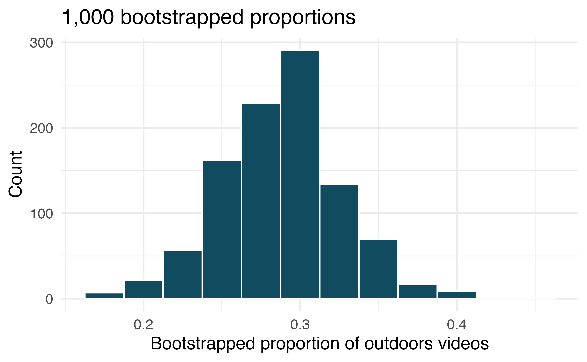
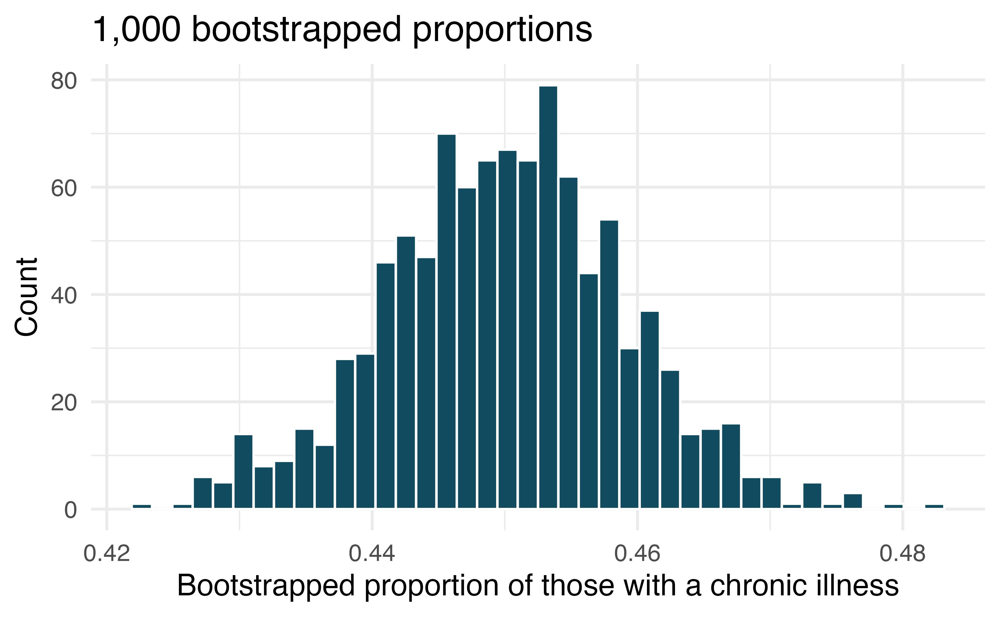
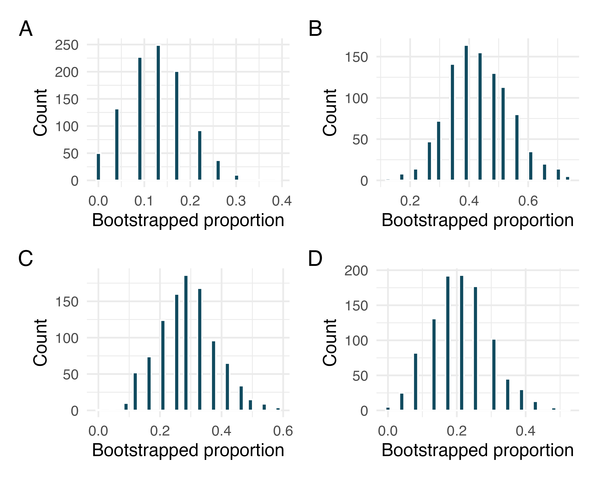

```{r setup, include=FALSE}
library(learnr)
library(gradethis)
library(openintro)
library(tidyverse)
library(infer)

healthcare_law_survey <-healthcare_law_survey %>% 
  mutate(response = ifelse(response == "approve", "approve", "don't approve"))

bootstrapped_samples <- healthcare_law_survey %>% 
  specify(response = response, success = "approve") %>%
  generate(reps = 1000, type = "bootstrap") %>% 
  calculate(stat = "prop")

gradethis::gradethis_setup()
knitr::opts_chunk$set(echo = FALSE)
```


## Pew Research Center poll on health care

We will be analyzing the data set `healthcare_law_survey`. Metadata for this data set can be found [here](https://www.openintro.org/data/index.php?data=healthcare_law_survey). We would like to estimate the proportion of Americans (in 2012) who approve of the ACA policy of requiring all Americans to have health insurance or face a fine. Please use the console below to take a look at the data set:

```{r sandbox, exercise=TRUE}

```

What is the parameter of interest and what is the sample in this scenario:

```{r parameter-sample, exercise=TRUE}
# Parameter:

# Sample:
```

Let's call the proportion of all Americans that approve of the policy $p_{app}$ and our point estimate of this quantity $\hat{p}_{app}$. In the console below, compute $\hat{p}_{app}$ (you may want to look at my slides from this lesson):

```{r p-hat, exercise=TRUE}

```


In the console below, create a data frame called `bootstrapped_samples` that contains 1000 bootstrapped proportions. Call the proportions `prop_approve`. If this seems to be taking a long time on your computer, do 100 bootstrapped samples. Future chunks will have 1000:

```{r bootstrapped-proportions, exercise=TRUE}

```

In the console below, compute the 2.5th and 97.5th percentiles:

```{r bootstrapped-proportions-quantiles, exercise=TRUE}

```


What is our point estimate and a 95% confidence interval for the $p_{app}$:

```{r point-estimate-ci, exercise=TRUE}
# Point estimate:

# 95% Confident interval:
```

Use the console below to compute a 99% confidence interval:

```{r ci-99, exercise=TRUE}

```

## Outside YouTube videos. 

Let’s say that you want to estimate the proportion of YouTube videos which take place outside (define “outside” to be if any part of the video takes place outdoors). You take a random sample of 128 YouTube videos and determine that 37 of them take place outside. You’d like to estimate the proportion of all YouTube videos which take place outside, so you decide to create a bootstrap interval from the original sample of 128 videos.

{width=100%}


a) Describe in words the relevant statistic and parameter for this problem. If you know the numerical value for either one, provide it. If you do not know the numerical value, explain why the value is unknown.

b) What notation is used to describe, respectively, the statistic and the parameter?

c) If using software to bootstrap the original dataset, what is the statistic calculated on each bootstrap sample?

d) When creating a bootstrap sampling distribution (histogram) of the bootstrapped sample proportions, where should the center of the histogram lie?

e) The histogram provides a bootstrap sampling distribution for the sample proportion (with 1000 bootstrap repetitions). Using the histogram, estimate a 90% confidence interval for the proportion of YouTube videos which take place outdoors.

f) In words of the problem, interpret the confidence interval which was estimated in the previous part.

```{r hw-1, exercise=TRUE}
# a)

# b)

# c)

# d)

# e)

# f)


```

```{r hw-1-solution}
# a) The statistic is the proportion of outside videos among the 128 sampled. The statistic is 0.289. The parameter is the proportion of outside videos among all YouTube videos. The parameter is not a number we can calculate (we cannot watch all YouTube videos).

# b) The notation used to describe the statistic is p̂ . The notation for the unknown parameter value is p.

# c) For each bootstrap sample, calculate the proportion of YouTube videos which take place outdoors.

# d) The histogram of bootstrap sample proportions will be centered at 0.289 (the sample proportion from the original dataset).

# e) To create the interval, we count 50 bootstrap repetitions in from each tail of the histogram (leaving 90% or 900 bootstrap repetitions in the middle). A rough approximation for the inteval is (0.22, 0.35).

# f) We can be 95% confident that between 22% and 35% of all YouTube videos take place outdoors.

```


## Chronic illness. 

In 2012 the Pew Research Foundation reported that “45% of US adults report that they live with one or more chronic conditions.” However, this value was based on a sample, so it may not be a perfect estimate for the population parameter of interest on its own. The study was based on a sample of 3014 adults. Below is a distribution of 1000 bootstrapped sample proportions from the Pew dataset. (Pew Research Center 2013a)

{width=100%}

Using the distribution of 1000 bootstrapped proportions, approximate a 92% confidence interval for the true proportion of US adults who live with one or more chronic conditions. Interpret the interval in the context of the problem.


```{r hw-2, exercise=TRUE}
# Answer:
```


```{r hw-2-solution}
# Answer: For a 92% confidence interval, we start by finding the bootstrap proportions that separate 40 on the left, 920 in the middle, and 40 on the right. The lower bound is approximately 0.446, and the upper bound is approximately 0.464. With 92% confidence, the true proportion of all US adults who live with one or more chronic conditions is between 0.446 and 0.464.
```


## Bootstrap distributions of $\hat{p}$, I.
Each of the following four distributions was created using a different dataset. Each dataset was based on $n=23$ observations. The original datasets had the following proportions of successes:

\[\hat{p} = 0.13, \hat{p} = 0.22, \hat{p} = 0.30, \hat{p} = 0.43\]
 
 {width=100%}

Match each histogram with the original data proportion of success.

```{r hw-3, exercise=TRUE}
# Answer:
```

```{r hw-3-solution}
# Answer:The data in A or perhaps D could have come from p=0.05.

# The data in A, B, C, or D could have come from p=0.25.

# The data in B or C could have come from p=0.45.

# The data in B could have come from p=0.55.

# None of the data could have come from p=0.75.
```

## Waiting at an ER. 

A 95% confidence interval for the mean waiting time at an emergency room (ER) of (128 minutes, 147 minutes). Answer the following questions based on this interval.

a) A local newspaper claims that the average waiting time at this ER exceeds 3 hours. Is this claim supported by the confidence interval? Explain your reasoning.

b) The Dean of Medicine at this hospital claims the average wait time is 2.2 hours. Is this claim supported by the confidence interval? Explain your reasoning.

c) Without actually calculating the interval, determine if the claim of the Dean from part (b) would be supported based on a 99% confidence interval?

```{r hw-4, exercise=TRUE}
# a)

# b)

# c)
```

```{r hw-4-solution}
# a) This claim does is not supported since 3 hours (180 minutes) is not in the interval.

# b) 2.2 hours (132 minutes) is in the 95% confidence interval, so we do not have evidence to say she is wrong.

# c) A 99% confidence interval will be wider than a 95% confidence interval. Even without calculating the interval, we can tell that 132 minutes would be in it, and we would not reject her claim based on a 99% confidence level as well.

```