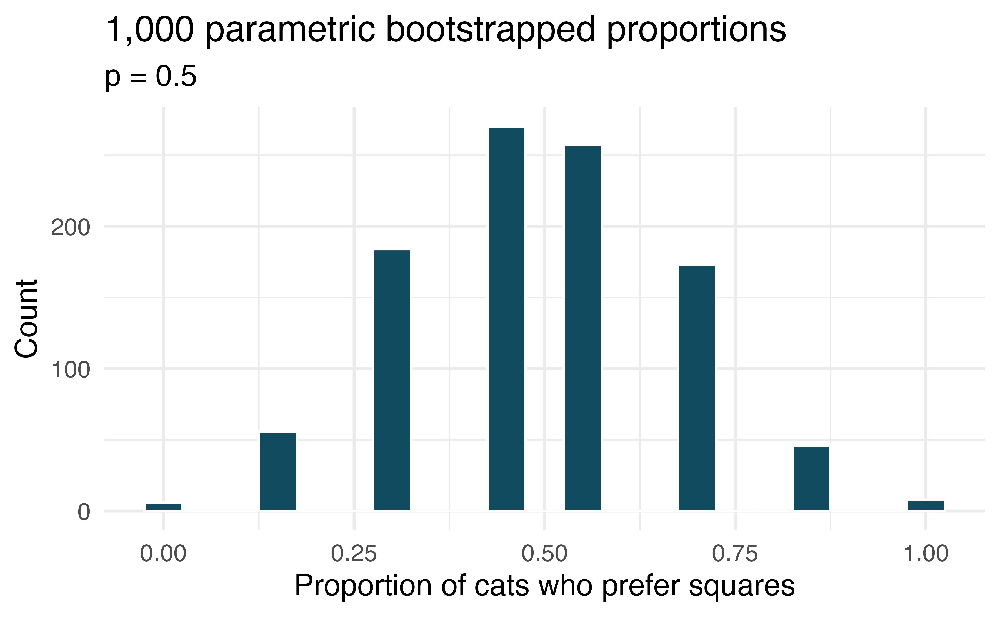

```{r setup, include=FALSE}
library(learnr)
library(openintro)
library(infer)
library(tidyverse)

knitr::opts_chunk$set(echo = FALSE)

mice <- tibble(mouse_id = seq(1, 127), result = sample(c(rep("perfume", 80), rep("no perfume", 127-80))))

cwd <- read_csv("https://raw.githubusercontent.com/EricFriedlander/MATH221SP22/main/Datasets/PRNPII-data.csv")

cwd_wi <- cwd %>% 
  filter(STATE == "WI") %>% 
  mutate(G96S = ifelse(G96S == "A", "A", "G"))

cwd <- cwd %>% 
  filter(Status != "NOT TESTED") %>% 
  mutate(Q95H = ifelse(Q95H == "A", "A", "M"),
         G96S = ifelse(G96S == "A", "A", "G"))

cwd_A <- cwd %>% 
  filter(G96S == "A")

obs_prop <- cwd_A %>% 
  specify(response = Status, success = "POSITIVE") %>% 
  calculate(stat = "prop")
```


## Olfactory Responses in Mice

Suppose you're a researcher who is researching the olfactory centers of mice. You are interested in investigating whether you can attract mice to a certain bowl of food by spraying the food with a "perfume" that contains pheromones from other mice. In your experiment a mouse is placed in between two bowls of food, one with the perfume and one without. The bowl that the mouse eats out of first is then recorded. Each mouse is independent of all other mice. The results of your experiment are stored in the data frame `mice`. Take a look at the data set below. 

```{r sandbox, exercise=TRUE}

```

Your task is conduct a hypothesis test for your research question. If you feel up to it, try and do it all in the console below. This includes selecting your own significance level. If you don't feel comfortable doing this the remaining consoles will walk you through the steps.

```{r advanced, exercise=TRUE}

```


Call the proportion of mice (in the population) that prefer the food with the perfume $p$. On a sheet of paper or in the console, write down what you think your null and alternative hypotheses are:

```{r hypotheses, exercise=TRUE}
# H0:
# HA:
```


```{r hypotheses-solution}
# H0: p=.5
# HA: p>.5
```

Compute the test statistic:

```{r test-statistic, exercise=TRUE}

```

```{r test-statistic-hint-1}
_____ %>% 
  _____
```

```{r test-statistic-hint-2}
_____ %>% 
  _____(point_estimate = mean(____ == "_____"))
```

```{r test-statistic-hint-3}
mice %>% 
  summarize(point_estimate = mean(result == "perfume"))
```

In the console below, compute the and standard error for this test:

```{r standard-error, exercise=TRUE}

```

```{r standard-error-hint-1}
sqrt(____ * (1 - _____)/_____)
```

```{r standard-error-hint-2}
sqrt(.5 * (1 - .5)/127)
```

Now compute your z-score and use the `normTail` function to display the regiong of the standard normal distribution corresponding to your p-value:

```{r z, exercise=TRUE}

```

```{r z-hint-1}
z_score <- 
z_score
normTail(____, ____, _____)
```

```{r z-hint-2}
z_score <- (_____ - _____)/_____
z_score
normTail(m=_____, s=____, U=_____)
```

```{r z-hint-3}
z_score <- (_____ - 0.5)/0.04436783
z_score
normTail(m=0, s=1, U=_____)
```

```{r z-hint-4}
z_score <- (0.630 - 0.5)/0.04436783
z_score
normTail(m=0, s=1, U=z_score)
```

Compute your p-value:

```{r p-val, exercise=TRUE}

```

```{r p-val-hint-1}
pnorm(____, ____, ____)
```

```{r p-val-hint-2}
pnorm(____, mean = ____, sd = ____)
```

```{r p-val-hint-3}
1-pnorm(2.930051, mean = 0, sd = 1)
```

```{r q-1}
question_radio(
"Would is the result of this hypothesis test with a significance level of $\\alpha = 0.05$",
answer("Fail to Reject the Null Hypothesis"),
answer("Reject the null hypothesis", correct=TRUE),
allow_retry=TRUE
)
```

## Global warming poll

A 2010 Pew Research poll asked 1,306 Americans, "From what you've read and heard, is there solid evidence that the average temperature on earth has been getting warmer over the past few decades, or not?" The resulting data can be found in the data frame `global_warming_pew`. Take a look at the data below:

```{r sandbox-gw, exercise=TRUE}

```

Your task is conduct a 90% confidence interval for the proportion of Americans (in 2010) who believe that the earth is warming. If you feel up to it, try and do it all in the console below. If you don't feel comfortable doing this the remaining consoles will walk you through the steps.

```{r ci-advanced, exercise=TRUE}

```

Remember that confidence intervals take the form $\hat{p}\pm z^*\times SE$. Let first compute $\hat{p}$, our point estimate, which will be the proportion of responders in our data set that say the "Earth is warming". Compute this number in the console below:

```{r point_est, exercise=TRUE}

```

```{r point_est-hint-1}
_____ %>% 
  _____
```

```{r point_est-hint-2}
_____ %>% 
  summarize(mean(_____=="_____"))
```

```{r point_est-hint-3}
global_warming_pew %>% 
  summarize(mean(response=="Earth is warming"))
```

Now that we have our point estimate, compute the standard error (technically the estimate of the standard error):

```{r standard-err, exercise=TRUE}

```

```{r standard-err-hint-1}
sqrt(_____*(1-_____)/_____)
```

```{r standard-err-hint-2}
sqrt(0.5996449*(1-0.5996449)/2253)
```

Compute $z^*$ for a 90% confidence interval:

```{r z-star, exercise=TRUE}

```

```{r z-star-hint-1}
qnorm(_____, _____, _____)
```

```{r z-star-hint-2}
qnorm(_____, mean=_____, sd=_____)
```

```{r z-star-hint-3}
qnorm(.95, mean=0, sd=1)
```

Now that we have all the ingredients that we need, compute the confidence interval:

```{r con-int, exercise=TRUE}

```

```{r con-int-hint-1}
_____ - _____ * _____
_____ + _____ * _____
```

```{r con-int-hint-2}
0.5996449 - 1.644854 * 0.0103226
0.5996449 + 1.644854 * 0.0103226
```


So our 90% confidence interval is (58.3%, 61.7%).

## Estimating Prevelance of G96S Mutations

You are doing research with Dr. Friedlander's esteemed colleague, Professor Adam Brandt, investigating Chronic Wasting Disease (CWD) in Wisconsin deer. A newly discovered mutation at the G96S SNP (having an `A` instead of a `G` at that site) shows promise in reducing the susceptibility of deer to CWD. Dr. Brandt assigns you to estimate the prevalence of this mutation in the deer population in Wisconsin. You can use the `cwd_wi` data frame which stores information on this mutation in the column `G96S`. Take a look around the dataset below:

```{r sandbox-3, exercise=TRUE}

```

After discussing the matter with Dr. Brandt you decide to construct a 95% confidence interval for the prevalence of this `A` mutation at the G96S position in the deer genome. In the console below, determine whether this data meets the *success-failure* condition (you may assume that the observations are independent):

```{r clt-1, exercise=TRUE}

```

```{r clt-1-hint-1}
cwd_wi %>% 
  count(G96S)
```

```{r q-2}
question_radio(
"Can you apply the CLT to this data",
answer("Yes, the independence and success-failure conditions are both met"),
answer("No, the independence condition is not met"),
answer("No, the success-failure condition is not met", correct=TRUE),
answer("No, neither the independence or success-failure conditions are met"),
allow_retry=TRUE
)
```

In the console below, if you feel confident (PUN INTENDED!!!!), construct a 95% bootstrapped confidence interval for the prevalence of this mutation. If you don't yet feel comfortable, walk through the steps below:

```{r advanced-boot-ci, exercise=TRUE}

```

First, compute a point estimate for the proportion of deer with this mutation:

```{r point-est-boot, exercise=TRUE}

```

```{r point-est-boot-hint-1}
cwd_wi %>% 
  summarize(_____)
```

```{r point-est-boot-hint-2}
cwd_wi %>% 
  summarize(mean(G96S == "A"))
```

Use the infer package to generate the 10,000 bootstrapped replicates of the data to approximate the sampling distribution for the prevalence of this mutation (call the resulting data frame `sampling_dist`) and then visualize this distribution:

```{r sampling-dist, exercise=TRUE}

```

```{r sampling-dist-hint-1}
sampling_dist <- _____ %>% 
  specify(response = _____, success= "_____") %>% 
  calculate(stat = "_____")

sampling_dist %>% 
  _____
```

```{r sampling-dist-hint-2}
sampling_dist <- cwd_wi %>% 
  specify(response = G96S, success = "A") %>% 
  generate(reps = 10000, type = "bootstrap") %>% 
  calculate(stat = "prop")

sampling_dist %>% 
  visualize(bins=100)
```

Now use the infer package to compute a 95% confidence interval based on this bootstrapped distribution and plot the shaded region using the `shade_ci` function:

```{r ci-boot-setup}
sampling_dist <- cwd_wi %>% 
  specify(response = G96S, success = "A") %>% 
  generate(reps = 10000, type = "bootstrap") %>% 
  calculate(stat = "prop")
```

```{r ci-boot, exercise=TRUE}
 
```

```{r ci-boot-hint-1}
ci <- _____ %>% 
  _____(_____ = ____)
ci

_____ %>% 
 _____ +  
  _____(_____)
```

```{r ci-boot-hint-2}
ci <- _____ %>% 
  get_ci(_____ = _____)
ci

sampling_dist %>% 
  visualize(bins=100) +  
  shade_ci(_____)
```

```{r ci-boot-hint-3}
ci <- sampling_dist %>% 
  get_ci(level = 0.95)
ci

sampling_dist %>% 
  visualize(bins=100) +  
  shade_ci(ci)
```

What is our point estimate and 95% confidence interval:

```{r boot-ci-final, exercise=TRUE}
# 
```

```{r boot-ci-final-solution}
# Our point estimate is 3.03% with a 95% confidence interval of 0.76% to 6.06%. 
```

## Susceptability of deer with mutation at G93S

You and Dr. Brandt would now like to test whether this new mutation actually provides any protection against CWD. Recall, that the rate of CWD in deer is around 4%. Formulate null and alternative hypotheses to test whether this new mutation reduces the rate of infection:

```{r boot-hyps, excise=TRUE}

```

```{r boot-hyps-solution}
# H0: p = 0.04
# HA: p<0.04
```

We are going to use a larger data set called `cwi` to answer this question. Let's first filter for only deer which have an `A` in the G95S position. Call the resulting data frame `cwi_A`. 

```{r filter, exercise=TRUE}

```

```{r filter-hint-1}
cwd_A <- cwd %>% 
  filter(______)
```

```{r filter-hint-2}
cwd_A <- cwd %>% 
  filter(G96S == "A")
```

Is the success-failure condition met for this hypothesis test?

```{r s-f-1, exercise=TRUE}

```

```{r s-f-1-hint-1}
0.04 * _____
```


```{r s-f-1-hint-2}
0.04 * 111
(1-0.04) * 111
```

```{r qs}
question_radio(
  "Is the success-failure condition met?",
  answer("Yes"),
  answer("No", correct=TRUE),
  allow_retry = TRUE
)
```

Compute the observed sample proportion from the data using the infer package. Call the result `obs_prop`:

```{r observed, exercise=TRUE}

```

```{r observed-hint-1}
obs_prop <- cwd_A %>% 
  specify(_____) %>% 
  calculate(_____)
obs_prop
```

```{r observed-hint-2}
obs_prop <- cwd_A %>% 
  specify(response = _____, success = "_____") %>% 
  calculate(stat = "______")
obs_prop
```

```{r observed-hint-3}
obs_prop <- cwd_A %>% 
  specify(response = Status, success = "POSITIVE") %>% 
  calculate(stat = "prop")
obs_prop
```

Use the infer package to generate the 10,000 replicate approximating the null distribution of this test and then visualize this distribution. Store the replicates in a data frame called `null_distribution`:

```{r reps-ht, exercise=TRUE}

```

```{r reps-ht-hint-1}
null_distribution <-_____ %>% 
  specify(_____) %>% 
  hypothesize(_____) %>% 
  generate(_____) %>% 
  calculate_____)

null_distribution %>% 
  visualize(bins=100)
```

```{r reps-ht-hint-2}
null_distribution <-cwd_A %>% 
  specify(response = _____, success = "_____") %>% 
  hypothesize(null = "____", p=_____) %>% 
  generate(reps = _____, type="_____") %>% 
  calculate(stat="_____")

null_distribution %>% 
  visualize(bins=100)
```

```{r reps-ht-hint-3}
null_distribution <-cwd_A %>% 
  specify(response = Status, success = "POSITIVE") %>% 
  hypothesize(null = "point", p=.04) %>% 
  generate(reps = 10000, type="draw") %>% 
  calculate(stat="prop")

null_distribution %>% 
  visualize(bins=100)
```

In the console below, compute the p-value of this test and use the `shade_p_value` function to visualize the p-value:

```{r final-p-value-setup}
null_distribution <-cwd_A %>% 
  specify(response = Status, success = "POSITIVE") %>% 
  hypothesize(null = "point", p=.04) %>% 
  generate(reps = 10000, type="draw") %>% 
  calculate(stat="prop")
```

```{r final-p-value, exercise=TRUE}

```

```{r final-p-value-hint-1}
null_distribution %>% 
  get_p_value(_____)

null_distribution %>% 
  visualize(bins=100) +
  shade_p_value(_____)
```

```{r final-p-value-hint-2}
null_distribution %>% 
  get_p_value(_____, direction="_____")

null_distribution %>% 
  visualize(bins=100) +
  shade_p_value(_____, direction = "_____")
```

```{r final-p-value-hint-3}
null_distribution %>% 
  get_p_value(obs_prop, direction="left")

null_distribution %>% 
  visualize(bins=100) +
  shade_p_value(obs_prop, direction = "left")
```


```{r named}
question_radio(
  "What is the result of this test?",
  answer("Fail to reject the null", correct=TRUE),
  answer("Reject the null"),
  allow_retry = TRUE
)
```

## If I fits, I sits, bootstrap test. 

A citizen science project on which type of enclosed spaces cats are most likely to sit in compared (among other options) two different spaces taped to the ground. The first was a square, and the second was a shape known as Kanizsa square illusion. When comparing the two options given to 7 cats, 5 chose the square, and 2 chose the Kanizsa square illusion. We are interested to know whether these data provide convincing evidence that cats prefer one of the shapes over the other. (Smith, Chouinard, and Byosiere 2021)

1. What are the null and alternative hypotheses for evaluating whether these data provide convincing evidence that cats have preference for one of the shapes

2. A parametric bootstrap simulation (with 1,000 bootstrap samples) was run and the resulting null distribution is displayed in the histogram below.Find the p-value using this distribution and conclude the hypothesis test in the context of the problem.

{width=100%}

```{r answer-1, exercise=TRUE}
# 1.

# 2. 
```

```{r answer-1-solution}
# 1. Let p be the true proportion of cats who prefer squares to Kanizsa spaces in the population. H0:p=0.5, HA:p≠0.5.The null is that cats in the population are equally likely to prefer the two spaces; the alternative is that cats in the population have a preference of one of the two spaces.

# 2. The observed statistic is p̂ =5/7=0.714. Over 200 of the repetitions calculated a bootstrapped proportion of 5/7 or higher. And knowing that the test of interest is two-sided, the p-value is roughly 0.4. There is not evidence in the data (possibly because there are only 7 cats being measured!) to conclude that the cats have a preference one way or the other between the two shapes.
```

## CLT for proportions. 

Define the term “sampling distribution” of the sample proportion, and describe how the shape, center, and spread of the sampling distribution change as the sample size increases when $p = 0.1$.

```{r answer-2, exercise=TRUE}
# 
```

```{r answer-2-solution}
# The sampling distribution is the distribution of sample proportions from samples of the same size randomly sampled from the same population. As the same size increases, the shape of the sampling distribution (when p=0.1) will go from being right-skewed to being more symmetric and resembling the normal distribution. With larger sample sizes, the spread of the sampling distribution gets smaller. Regardless of the sample size, the center of the sampling distribution is equal to the true mean of that population, provided the sampling isn’t biased.
```

## Young Americans, American dream. 

About 77% of young adults think they can achieve the American dream. Determine if the following statements are true or false, and explain your reasoning. (Vaughn 2011)

1. The distribution of sample proportions of young Americans who think they can achieve the American dream in random samples of size 20 is left skewed.

2. The distribution of sample proportions of young Americans who think they can achieve the American dream in random samples of size 40 is approximately normal since $n\geq 30$.

3. A random sample of 60 young Americans where 85% think they can achieve the American dream would be considered unusual.

4. A random sample of 120 young Americans where 85% think they can achieve the American dream would be considered unusual.

```{r answer-3, exercise=TRUE}
# 1.

# 2.

# 3.

# 4. 
```

```{r answer-3-solution}
# 1. True. The success-failure condition is not satisfied np=20×0.77=15.4 and n(1−p)=20×0.23=4.6, therefore we know that the distribution of p̂  is not approximately normal. In most samples we would expect p̂  to be close to 0.77, the true population proportion. While p̂  can be as low as 0 (though we would expect this to happen very rarely), it can only go as high as 1. Therefore, since 0.77 is closer to 1, the distribution would probably take on a left skewed shape. Plotting the sampling distribution would confirm this suspicion.

# 2. False. Unlike with means, for the sampling distribution of proportions to be approximately normal, we need to have at least 10 successes and 10 failures in our sample. We do not use n≥30 as a condition to check for the normality of the distribution of p̂ .

# 3. False. Standard error of p̂  in samples with n=60 can be calculated as: SEp̂ =sqrt(p(1−p)/n)=sqrt(0.77×0.23/60)=0.0543. A p̂  of 0.85 is only (.85-.7)/0.05433.008 standard errors away from the mean, which would be considered unusual.

# 4. True. Standard error of p̂  in samples with n=120 can be calculated as: SEp̂ =sqrt(p(1−p)/n)=sqrt(0.77×0.23/120)=0.0384. A p̂  of 0.85 is Z=(0.85−0.77)/0.046=2.08 standard errors away from the mean, which would not be considered unusual.
```

## Will the coronavirus bring the world closer together? 

An April 2021 YouGov poll asked 4,265 UK adults whether they think the coronavirus bring the world closer together or leave us further apart. 12% of the respondents said it will bring the world closer together. 37% said it would leave us further apart, 39% said it won’t make a difference and the remainder didn’t have an opinion on the matter. (YouGov 2021)

1. Calculate, using a mathematical model, a 90% confidence interval for the proportion of UK adults who think the coronavirus will bring the world closer together, and interpret the interval in context.

2. Suppose we wanted the margin of error for the 90% confidence level to be about 0.5%. How large of a sample size would you recommend for the poll?

```{r answer-4, exercise=TRUE}
# 1.

# 2.


```

Solutions in the next section.

## Will the coronavirus bring the world closer together? (Solutions)

1. We are 90% confident that 11% to 13% of UK adults think the coronavirus will bring the world closer together.

\[
\begin{aligned}
 \hat{p} \pm z^{\star} \sqrt{ \frac{\hat{p} (1 - \hat{p})}{n} } 
 &= 0.12 \pm 1.64 \times \sqrt{\frac{0.12 \times 0.88}{4265}} \\
 &= 0.12 \pm 1.64 \times 0.005 \\
 &= 0.12 \pm 0.0082 \\
 &= (0.11 , 0.13)
 \end{aligned}
 \]
 
 2. We are asked to solve for the sample size required to achieve a 0.5% margin of error for a 90% confidence interval and the point estimate is p̂ =0.12. The sample size n should be at least 11361.
 
 \[
 \begin{aligned}
 ME = z^{\star} \sqrt{ \frac{\hat{p} (1-\hat{p})} {n} } \ \rightarrow \ 0.005 
 &\ge 1.64 \sqrt{ \frac{0.12 \times 0.88} {n} } \\
 0.005^2 &\ge 1.64^2  \frac{0.12 \times 0.88}{n} \\
 n &\ge \frac{1.64^2 \times 0.12 \times 0.88}{0.005^2} \\
 n &\ge 11361
 \end{aligned}
 \]
 
## Submit

```{css echo=FALSE}
@media print {
  .topicsContainer,
  .topicActions,
  .exerciseActions .skip {
    display: none;
  }
  .topics .tutorialTitle,
  .topics .section.level2,
  .topics .section.level3:not(.hide) {
    display: block;
  }
  .topics {
    width: 100%;
  }
  .tutorial-exercise, .tutorial-question {
    page-break-inside: avoid;
  }
  .section.level3.done h3 {
    padding-left: 0;
    background-image: none;
  }
  .topics .showSkip .exerciseActions::before {
    content: "Topic not yet completed...";
    font-style: italic;
  }
}
```

Make sure you have the tutorial open in a browser (preferably Google Chrome). Please press `print page` button below to print the tutorial. Print it to a `pdf` file and upload it into Moodle. Make sure all code boxed are visible. If you can't do that please submit your answers to [the Google Form](https://forms.gle/bhWEjfaHazhDzATCA).

```{js print2pdf1, context="server"}
    // the following 2 chunks print the completed sections of the tutorial to PDF
    // uses "css/print2pdf.css"
    $(document).on('shiny:inputchanged', function(event) {
      if (event.name === 'print2pdf') {
        window.print();
      }
    });
```
    
```{r print2pdf2}
    # button can be placed anywhere in the tutorial
    actionButton("print2pdf", "Print page", style="opacity: .7; color: #000;")
```
 
